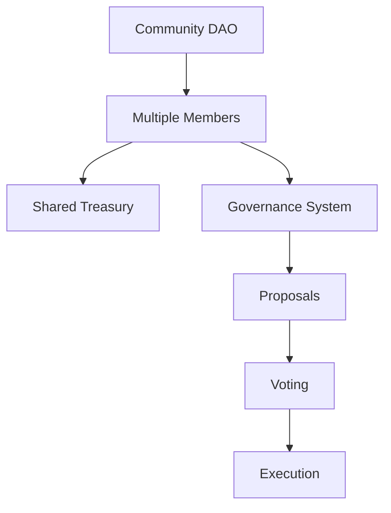
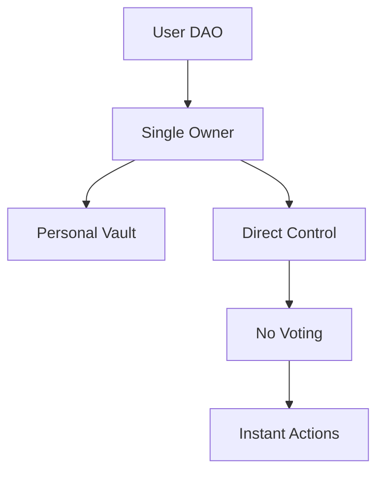
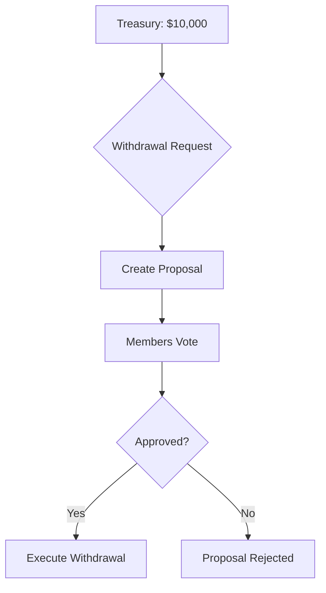
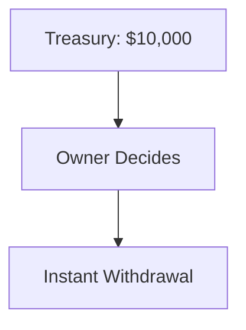

---
title: Community vs User DAOs
description: Understanding the difference between collective and individual DAOs
---

# Community vs User DAOs

## Overview

MtaaDAO supports two fundamentally different DAO types: **Community DAOs** (collective governance) and **User DAOs** (personal management). Understanding the difference is crucial for choosing the right structure.

---

## Quick Comparison

| Aspect | Community DAO | User DAO |
|--------|---------------|----------|
| **Ownership** | Shared among members | Single user |
| **Decision Making** | Voting required | Owner decides |
| **Treasury** | Multi-sig vault | Personal vault |
| **Use Case** | Groups, organizations | Personal finance |
| **Governance** | Proposals + voting | Direct control |
| **Complexity** | High | Low |

---

## Community DAOs

### What is a Community DAO?

A **Community DAO** is a collectively governed organization where members vote on decisions:



### Characteristics

```typescript
const communityDAO = {
  members: 50, // Multiple people
  governance: {
    voting: "required",
    quorum: "30%",
    approval: "60%"
  },
  treasury: {
    type: "multi-sig",
    withdrawals: "requires approval",
    transparency: "full"
  },
  structure: {
    roles: ["admin", "elder", "proposer", "member"],
    permissions: "role-based",
    hierarchy: true
  }
};
```

### Use Cases

**Perfect for:**
- ✅ Investment clubs (chamas)
- ✅ Community organizations
- ✅ Project teams
- ✅ Cooperative businesses
- ✅ Charity foundations

**Example:**
```typescript
const chamaDAO = {
  name: "Youth Investment Club",
  members: 20,
  monthlyContribution: "500 KES per member",
  treasury: "10,000 KES total",
  
  governance: {
    votingPower: "equal", // 1 member = 1 vote
    proposals: [
      "Invest in crypto",
      "Distribute dividends",
      "Add new member"
    ]
  }
};
```

---

## User DAOs

### What is a User DAO?

A **User DAO** is a personal management tool for an individual:



### Characteristics

```typescript
const userDAO = {
  owner: "single_user",
  governance: {
    voting: "not required",
    decisions: "instant",
    approval: "owner only"
  },
  treasury: {
    type: "personal vault",
    withdrawals: "immediate",
    transparency: "private"
  },
  structure: {
    roles: ["owner"],
    permissions: "full control",
    hierarchy: false
  }
};
```

### Use Cases

**Perfect for:**
- ✅ Personal savings
- ✅ Freelancer income management
- ✅ Family finances (single manager)
- ✅ Individual investments
- ✅ Personal project funds

**Example:**
```typescript
const personalDAO = {
  name: "John's Savings",
  owner: "john@example.com",
  
  vaults: [
    { name: "Emergency Fund", balance: "5000 KES" },
    { name: "Vacation Savings", balance: "2000 KES" },
    { name: "Investment Portfolio", balance: "10000 KES" }
  ],
  
  transactions: "No approval needed"
};
```

---

## Detailed Differences

### 1. Governance Model

**Community DAO:**
```typescript
// Withdrawal requires proposal + voting
const proposal = await createProposal({
  type: "withdraw",
  amount: "1000 KES",
  reason: "Pay for event venue"
});

await voteOnProposal(proposal.id); // Members vote
// Wait for quorum + approval
await executeProposal(proposal.id); // Executed if passed
```

**User DAO:**
```typescript
// Direct withdrawal, no voting
const withdrawal = await withdraw({
  amount: "1000 KES",
  destination: "myWallet"
});
// Instant execution
```

### 2. Treasury Management

**Community DAO:**


**User DAO:**


### 3. Membership

**Community DAO:**
```typescript
const membership = {
  joinProcess: {
    step1: "Apply to join",
    step2: "Existing members vote",
    step3: "Approved if quorum met"
  },
  
  roles: {
    admin: ["Create DAO", "Manage members"],
    elder: ["Create proposals", "Vote"],
    proposer: ["Create proposals", "Vote"],
    member: ["Vote only"]
  },
  
  removal: {
    process: "Governance proposal",
    votingRequired: true
  }
};
```

**User DAO:**
```typescript
const membership = {
  owner: "Only one person",
  roles: "No roles needed",
  removal: "N/A - can't remove yourself"
};
```

### 4. Transparency

**Community DAO:**
```typescript
const transparency = {
  treasury: "All members see balance",
  transactions: "Publicly visible to members",
  proposals: "Full voting history",
  decisions: "Traceable to votes"
};
```

**User DAO:**
```typescript
const transparency = {
  treasury: "Only owner sees balance",
  transactions: "Private",
  proposals: "No proposals",
  decisions: "Owner's choice"
};
```

---

## When to Choose Which

### Choose Community DAO When:

✅ You have **multiple people** who should have a say  
✅ You need **democratic decision-making**  
✅ You want **transparency** and accountability  
✅ You're managing **shared funds**  
✅ You need **role-based permissions**

**Examples:**
- Chama (investment club)
- Community project
- Cooperative business
- Charity organization
- Team treasury

### Choose User DAO When:

✅ You're managing **personal funds**  
✅ You want **full control** without voting  
✅ You need **instant decisions**  
✅ You prefer **privacy**  
✅ You're a **sole proprietor**

**Examples:**
- Personal savings
- Freelancer income
- Individual investment
- Family finances (single manager)
- Personal project funds

---

## Hybrid Approach

Some users create both:

```typescript
const hybridSetup = {
  communityDAO: {
    name: "Youth Investment Club",
    members: 20,
    treasury: "200,000 KES",
    purpose: "Collective investments"
  },
  
  userDAO: {
    name: "My Personal Funds",
    owner: "myself",
    treasury: "50,000 KES",
    purpose: "Personal savings"
  },
  
  workflow: "Contribute to community DAO from personal DAO"
};
```

---

## Feature Comparison

### Governance

| Feature | Community DAO | User DAO |
|---------|---------------|----------|
| **Proposals** | Required | Not needed |
| **Voting** | Yes | No |
| **Quorum** | 20-50% | N/A |
| **Approval** | 51-75% | Owner decides |
| **Execution Delay** | 1-7 days | Instant |

### Treasury

| Feature | Community DAO | User DAO |
|---------|---------------|----------|
| **Type** | Multi-sig vault | Personal vault |
| **Visibility** | All members | Owner only |
| **Withdrawals** | Proposal-based | Direct |
| **Deposits** | Anyone can contribute | Owner controls |

### Roles & Permissions

| Feature | Community DAO | User DAO |
|---------|---------------|----------|
| **Roles** | 4+ (admin, elder, proposer, member) | 1 (owner) |
| **Permissions** | Role-based | Owner has all |
| **Hierarchy** | Yes | No |
| **Member Management** | Via proposals | N/A |

---

## Migration Path

### From User DAO to Community DAO

```typescript
const migrationSteps = [
  {
    step: 1,
    action: "Create Community DAO",
    note: "Keep user DAO intact"
  },
  {
    step: 2,
    action: "Transfer funds from personal vault to community vault",
    method: "Standard transaction"
  },
  {
    step: 3,
    action: "Invite members",
    note: "Send invitation links"
  },
  {
    step: 4,
    action: "Set up governance rules",
    settings: "Quorum, approval threshold, roles"
  },
  {
    step: 5,
    action: "Archive or delete user DAO",
    optional: true
  }
];
```

---

## Cost Comparison

### Community DAO Costs

```typescript
const communityCosts = {
  creation: "1,000 MTAA",
  monthlyFees: "0 MTAA (free tier)",
  
  optionalUpgrades: {
    premiumFeatures: "200 MTAA/month",
    customBranding: "500 MTAA one-time",
    advancedAnalytics: "100 MTAA/month"
  }
};
```

### User DAO Costs

```typescript
const userCosts = {
  creation: "Free",
  monthlyFees: "0 MTAA",
  
  note: "User DAOs are completely free"
};
```

---

## Security Considerations

### Community DAO Security

```typescript
const communitySecurity = {
  multiSig: {
    enabled: true,
    threshold: "3-of-5 for large transactions"
  },
  
  proposalSafety: {
    cooldownPeriod: "24 hours",
    executionDelay: "48 hours for large changes",
    emergencyPause: "Admin can pause in crisis"
  },
  
  memberSafety: {
    votingPowerLimits: "No single member >50%",
    banMechanism: "Proposal to remove malicious members"
  }
};
```

### User DAO Security

```typescript
const userSecurity = {
  ownerControl: {
    fullAccess: true,
    noMultiSig: "Owner has complete control"
  },
  
  walletSecurity: {
    seedPhrase: "User responsible for backup",
    2FA: "Recommended but optional",
    encryption: "Wallet encrypted at rest"
  }
};
```

---

## Real-World Examples

### Community DAO Success Story

```typescript
const chamaExample = {
  name: "Nairobi Tech Chama",
  members: 15,
  founded: "2024-06-01",
  
  stats: {
    totalDeposits: "750,000 KES",
    investments: [
      { type: "Crypto", amount: "300,000 KES", return: "+18%" },
      { type: "Stocks", amount: "250,000 KES", return: "+12%" },
      { type: "Savings", amount: "200,000 KES", return: "+5%" }
    ],
    totalReturn: "+15.2%",
    membersEarned: "114,000 KES total"
  },
  
  governance: {
    proposalsVoted: 24,
    passRate: "83%",
    avgTurnout: "87%"
  }
};
```

### User DAO Success Story

```typescript
const personalExample = {
  owner: "Alice Wanjiru",
  purpose: "Freelance income management",
  
  stats: {
    monthlyIncome: "80,000 KES",
    allocation: {
      emergencyFund: "20,000 KES",
      investments: "30,000 KES",
      expenses: "30,000 KES"
    },
    
    growth: {
      startingBalance: "50,000 KES",
      currentBalance: "350,000 KES",
      timeFrame: "12 months",
      return: "+600%"
    }
  }
};
```

---

## Support

Need help choosing the right DAO type?

- **Discord**: #dao-types channel
- **Email**: support@mtaadao.com
- **Consultation**: Book a free 30-min call
