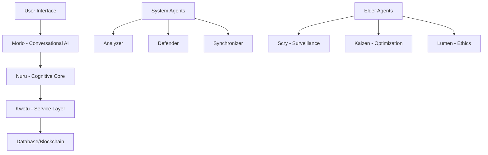

---
title: AI Layer - Complete Integration Guide
description: Developer guide for integrating Morio, Nuru, and Kwetu into your MtaaDAO applications
---

# AI Layer - Complete Integration Guide

## Table of Contents

1. [Architecture Overview](#architecture-overview)
2. [Quick Start](#quick-start)
3. [Morio Integration](#morio-integration)
4. [Nuru Analytics](#nuru-analytics)
5. [Kwetu Services](#kwetu-services)
6. [Elder Agents](#elder-agents)
7. [Advanced Patterns](#advanced-patterns)
8. [Best Practices](#best-practices)

---

## Architecture Overview

### The Three Tiers



### Communication Flow

```typescript
// User Query Flow
User Input
  ↓
Morio (Interface) - Receives request
  ↓
Nuru (Reasoning) - Validates and analyzes
  ↓
Kwetu (Execution) - Performs operation
  ↓
Database/Blockchain - Updates state
  ↓
Morio - Returns response to user
```

---

## Quick Start

### Installation

The AI layer is built-in to MtaaDAO. No separate installation required.

### Basic Usage

```typescript
import { MorioProvider } from "@/components/MorioProvider";

function App() {
  const { user } = useAuth();
  
  return (
    <MorioProvider userId={user?.id} daoId={user?.currentDaoId}>
      <YourApp />
    </MorioProvider>
  );
}
```

---

## Morio Integration

### Setting Up Morio Chat

```typescript
import { MorioChat } from '@/components/morio/MorioChat';

function Dashboard() {
  const userId = useUser().id;
  const daoId = useCurrentDao().id;

  return (
    <div className="dashboard">
      <MorioChat 
        userId={userId} 
        daoId={daoId}
        isOnboarding={false}
      />
    </div>
  );
}
```

### Floating Action Button

```typescript
import { MorioFAB } from '@/components/morio/MorioFAB';

function App() {
  return (
    <>
      <YourApp />
      <MorioFAB userId={user.id} />
    </>
  );
}
```

### Sending Messages

```typescript
// Client-side API call
const response = await fetch('/api/morio/chat', {
  method: 'POST',
  headers: { 'Content-Type': 'application/json' },
  body: JSON.stringify({
    userId: 'user-123',
    daoId: 'dao-456',
    message: 'What is our treasury balance?'
  })
});

const data = await response.json();
// {
//   text: "Your DAO treasury has 50,000 cUSD...",
//   intent: "check_balance",
//   confidence: 0.95,
//   suggestions: ["View transaction history", "Check vault allocations"],
//   actions: [{ type: "view_balance", label: "View Full Balance" }]
// }
```

### Supported Intents

```typescript
type MorioIntent =
  | 'withdraw'           // "I want to withdraw 5000"
  | 'deposit'            // "Deposit money"
  | 'check_balance'      // "How much do we have?"
  | 'submit_proposal'    // "Create a proposal"
  | 'vote'               // "Vote on proposal #42"
  | 'join_dao'           // "How do I join?"
  | 'analytics'          // "Show me stats"
  | 'help';              // "What can you do?"
```

### Multi-Language Support

```typescript
// Morio auto-detects language
const swahiliQuery = "Pesa zetu ni ngapi?";
const englishQuery = "What's our treasury balance?";

// Both return appropriate responses
```

---

## Nuru Analytics

### Understanding User Input

```typescript
import { nuru } from '@/core/nuru';

// Classify intent
const understanding = await nuru.understand(
  "I want to withdraw 5000 KES",
  { userId, daoId }
);

// Returns:
// {
//   intent: 'withdraw',
//   entities: { amount: 5000, currency: 'KES' },
//   confidence: 0.95,
//   language: 'en',
//   sentiment: 0.7
// }
```

### Financial Analytics

```typescript
// Get treasury insights
const analysis = await nuru.analyze({
  type: 'treasury',
  daoId: 'dao-123',
  timeframe: 'last-month'
});

// Returns:
// {
//   summary: "Treasury balance is $50,000 with 8.5% growth rate...",
//   metrics: {
//     currentBalance: 50000,
//     burnRate: 5000,
//     runway: 10,
//     growthRate: 0.085
//   },
//   insights: ["Strong treasury growth indicates healthy engagement"],
//   risks: [],
//   recommendations: ["Consider allocating surplus to vaults"]
// }
```

### Governance Analytics

```typescript
// Track voting patterns
const governance = await nuru.analyze({
  type: 'governance',
  daoId: 'dao-123'
});

// Returns:
// {
//   participationRate: 67.5,
//   proposalSuccessRate: 83,
//   quorumAchievement: 92,
//   topVoters: [...],
//   votingPatterns: {...}
// }
```

### Risk Assessment

```typescript
// Evaluate proposal risks
const risk = await nuru.assessRisk('proposal-123', 'dao-456');

// Returns:
// {
//   overall: "medium",
//   score: 45,
//   factors: {
//     budgetCompliance: true,
//     conflictOfInterest: false,
//     communityBenefit: 0.75,
//     riskLevel: "medium",
//     fairnessScore: 0.85
//   },
//   recommendations: ["Consider phased implementation"]
// }
```

---

## Kwetu Services

### Treasury Service

```typescript
import { treasuryService } from '@/core/kwetu/services/treasury_service';

// Get balance
const balance = await treasuryService.getBalance('dao-123');

// Process deposit
const deposit = await treasuryService.processDeposit({
  daoId: 'dao-123',
  userId: 'user-456',
  amount: 5000,
  currency: 'cUSD'
});

// Execute withdrawal
const withdrawal = await treasuryService.executeWithdrawal({
  daoId: 'dao-123',
  proposalId: 'prop-789',
  amount: 1000,
  recipient: '0x...'
});
```

### Governance Service

```typescript
import { governanceService } from '@/core/kwetu/services/governance_service';

// Get active proposals
const proposals = await governanceService.getProposals('dao-123', 'active');

// Get proposal details
const proposal = await governanceService.getProposalById('prop-123');

// Get voting power
const power = await governanceService.getVotingPower('user-456', 'dao-123');
```

### Community Service

```typescript
import { communityService } from '@/core/kwetu/services/community_service';

// Get member stats
const stats = await communityService.getMemberStats('dao-123');

// Record contribution
await communityService.recordContribution({
  userId: 'user-456',
  daoId: 'dao-123',
  type: 'task_completion',
  value: 100
});

// Get leaderboard
const leaders = await communityService.getLeaderboard('dao-123');
```

### Onboarding Service

```typescript
import { onboardingService } from '@/core/kwetu/services/onboarding_service';

// Get onboarding status
const status = await onboardingService.getOnboardingStatus('user-456');

// Complete step
await onboardingService.completeStep('user-456', 'wallet-setup');

// Reset onboarding
await onboardingService.resetOnboarding('user-456');
```

---

## Elder Agents

### Scry - Surveillance Elder

```typescript
// Monitor suspicious activity
import { eldScry } from '@/core/elders/scry';

// Enable surveillance for DAO
await eldScry.enableSurveillance('dao-123');

// Get threat analysis
const threats = await eldScry.analyzeThreat('dao-123');

// Returns:
// {
//   level: "medium",
//   indicators: [...],
//   recommendations: [...]
// }
```

### Kaizen - Optimization Elder

```typescript
import { eldKaizen } from '@/core/elders/kaizen';

// Get optimization suggestions
const optimizations = await eldKaizen.analyze('dao-123');

// Returns:
// {
//   gasOptimizations: [...],
//   workflowImprovements: [...],
//   costSavings: [...],
//   performanceGains: [...]
// }
```

### Lumen - Ethics Elder

```typescript
import { eldLumen } from '@/core/elders/lumen';

// Ethical review of proposal
const review = await eldLumen.reviewProposal('prop-123');

// Returns:
// {
//   ethical: true,
//   concerns: [],
//   recommendations: ["Add transparency measures"],
//   score: 85
// }
```

---

## Advanced Patterns

### Morio Data Hub

```typescript
import { useMorioDataHub } from '@/hooks/useMorioDataHub';

function MorioWidget() {
  const { data, isLoading, refetch } = useMorioDataHub({
    userId: 'user-123',
    daoId: 'dao-456'
  });

  return (
    <div>
      <h3>Morio Insights</h3>
      <p>Contribution Score: {data?.contributionScore}</p>
      <p>Active Streak: {data?.activeStreak} days</p>
      <p>Next Reward: {data?.nextReward}</p>
    </div>
  );
}
```

### Custom Intent Handlers

```typescript
// Extend Morio with custom intents
import { morio } from '@/core/morio';

morio.registerIntent({
  name: 'custom_action',
  patterns: ['do something special', 'perform custom action'],
  handler: async (context) => {
    // Your custom logic
    return {
      text: "Custom action completed!",
      actions: [...]
    };
  }
});
```

### Agent Communication

```typescript
import { messageBus } from '@/core/agent-framework/message-bus';

// Subscribe to agent events
messageBus.subscribe('threat_detected', async (message) => {
  console.log('Threat detected:', message.payload);
  // Handle threat
});

// Publish event
messageBus.publish({
  type: 'user_action',
  source: 'web-app',
  payload: {
    userId: 'user-123',
    action: 'large_withdrawal',
    amount: 50000
  }
});
```

---

## Best Practices

### Error Handling

```typescript
try {
  const response = await morio.chat('user-123', 'dao-456', message);
} catch (error) {
  if (error.code === 'RATE_LIMIT_EXCEEDED') {
    // Show rate limit message
  } else if (error.code === 'INVALID_INTENT') {
    // Ask user to rephrase
  } else {
    // Generic error handling
  }
}
```

### Performance Optimization

```typescript
// Cache Morio responses
import { useQuery } from '@tanstack/react-query';

const { data } = useQuery({
  queryKey: ['morio-data', userId, daoId],
  queryFn: () => fetchMorioData(userId, daoId),
  staleTime: 5 * 60 * 1000, // 5 minutes
});
```

### Security

```typescript
// Always validate user permissions
const canWithdraw = await kwetu.checkPermission({
  userId: 'user-123',
  daoId: 'dao-456',
  action: 'withdraw'
});

if (!canWithdraw) {
  throw new Error('Insufficient permissions');
}
```

---

## API Reference

### Morio Endpoints

```typescript
// Send message
POST /api/morio/chat
Body: { userId, daoId, message }
Response: { text, intent, confidence, suggestions, actions }

// Get session
GET /api/morio/session/:userId
Response: { sessionId, messages[], context }

// Clear session
DELETE /api/morio/session/:userId
Response: { success: true }
```

### Nuru Endpoints

```typescript
// Analyze
POST /api/nuru/analyze
Body: { type, daoId, timeframe }
Response: { summary, metrics, insights, recommendations }

// Risk assessment
POST /api/nuru/risk-assessment
Body: { proposalId, daoId }
Response: { overall, score, factors, recommendations }
```

### Kwetu Endpoints

```typescript
// Treasury operations
GET /api/kwetu/treasury/:daoId/balance
POST /api/kwetu/treasury/:daoId/deposit
POST /api/kwetu/treasury/:daoId/withdraw

// Governance operations
GET /api/kwetu/governance/:daoId/proposals
GET /api/kwetu/governance/:daoId/voting-power/:userId
```

---

## Troubleshooting

### Common Issues

**Q: Morio not responding**  
A: Check API endpoint, user authentication, and rate limits

**Q: Nuru analysis slow**  
A: Use caching, reduce analysis scope, or use async processing

**Q: Kwetu service errors**  
A: Verify user permissions, check database connection, validate input data

---

## Support

- **Documentation**: [docs.mtaadao.com/ai-layer](https://docs.mtaadao.com/ai-layer)
- **Discord**: #ai-development channel
- **GitHub**: [Issues](https://github.com/mtaadao/issues)
- **Email**: dev@mtaadao.com

---

**Last Updated**: January 2025  
**Version**: 3.0  
**Status**: Production Ready
