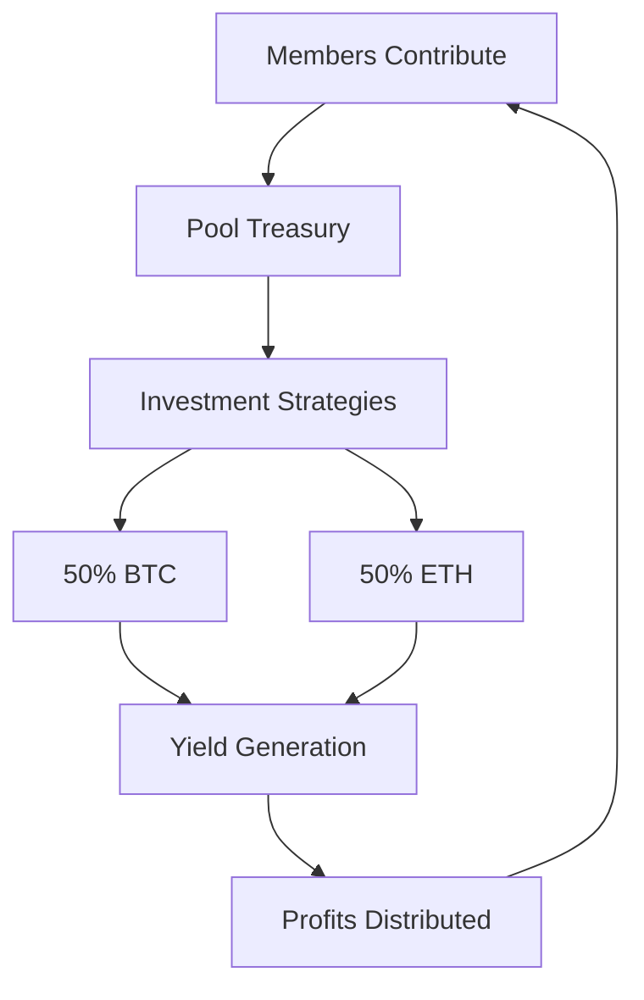

---
title: Investment Pools - Complete Guide
description: Everything you need to know about creating, managing, and governing investment pools
---

# Investment Pools - Complete Guide

## Table of Contents

1. [Overview](#overview)
2. [Pool Types & Structures](#pool-types--structures)
3. [Creating Your First Pool](#creating-your-first-pool)
4. [Investment Strategies](#investment-strategies)
5. [Governance & Voting](#governance--voting)
6. [Performance Tracking](#performance-tracking)
7. [Risk Management](#risk-management)
8. [Advanced Features](#advanced-features)
9. [API Reference](#api-reference)

---

## Overview

Investment Pools are MtaaDAO's flagship feature for collective crypto investing. Built on Celo's ERC-4626 vault standard, they enable groups to pool funds, invest in multiple assets, and share profits democratically.

### Key Benefits

✅ **Collective Buying Power** - Pool resources for larger investments  
✅ **Professional Management** - Optional managed strategies  
✅ **Democratic Control** - Share-weighted governance  
✅ **Transparent Performance** - Real-time tracking  
✅ **Risk Diversification** - Multi-asset portfolios  
✅ **Automated Rebalancing** - Maintain target allocations  

### How It Works



---

## Pool Types & Structures

### 1. Standard 50/50 Pools (Live)

**Current Implementation**

```typescript
const standardPool = {
  assets: [
    { symbol: "BTC", allocation: 5000 }, // 50%
    { symbol: "ETH", allocation: 5000 }  // 50%
  ],
  minInvestment: "10 USD",
  performanceFee: 200, // 2%
  managementFee: 200,  // 2%
  rebalanceFrequency: "6h"
};
```

**Best For:**
- Conservative investors
- First-time pool creators
- Long-term holdings
- Steady growth strategies

### 2. Custom Allocation Pools (Coming Q1 2026)

**Flexible Multi-Asset**

```typescript
const customPool = {
  assets: [
    { symbol: "BTC", allocation: 4000 },  // 40%
    { symbol: "ETH", allocation: 3000 },  // 30%
    { symbol: "SOL", allocation: 2000 },  // 20%
    { symbol: "MATIC", allocation: 1000 } // 10%
  ]
};
```

### 3. Strategy Pools (Coming Q2 2026)

**Active DeFi Strategies**

- **Yield Farming Pools** - Stake assets in DeFi protocols
- **Liquidity Pools** - Provide liquidity on DEXs
- **Staking Pools** - Stake proof-of-stake tokens
- **Arbitrage Pools** - Automated trading strategies

---

## Creating Your First Pool

### Step-by-Step Guide

#### Step 1: Prerequisites

Before creating a pool, ensure you have:

- [ ] Active DAO with Collective tier or higher
- [ ] At least 50 active members
- [ ] 6+ months operational history
- [ ] Good financial health (no defaults)
- [ ] Minimum ₭5,000 treasury balance

#### Step 2: Pool Configuration

```typescript
// Navigate to /investment-pools/create

const poolConfig = {
  daoId: "dao-123",
  name: "Youth Crypto Investment Club",
  symbol: "YCIC",
  description: "A pool for young investors to learn and earn together",
  
  // Investment parameters
  minimumInvestment: "10",
  performanceFee: 200,  // 2%
  managementFee: 200,   // 2%
  
  // Asset allocation
  assets: [
    { symbol: "BTC", allocation: 5000 },
    { symbol: "ETH", allocation: 5000 }
  ],
  
  // Governance
  quorumPercentage: 3000, // 30%
  approvalThreshold: 6000, // 60%
  votingDuration: 7 // days
};
```

#### Step 3: Initial Deposit

Pool creators should seed the pool:

```typescript
// Minimum seed: ₭100
await investInPool({
  poolId: "pool-123",
  amount: 100,
  currency: "cUSD"
});
```

#### Step 4: Invite Members

Share your pool link:

```
https://mtaadao.com/investment-pools/pool-123
```

---

## Investment Strategies

### Conservative Strategy (6-10% APY)

**Risk Level:** Low  
**Time Horizon:** 1+ years  
**Best For:** Risk-averse investors, emergency funds

```typescript
const conservative = {
  allocation: {
    stablecoins: 40%, // cUSD in Mento
    BTC: 30%,         // Long-term hold
    ETH: 30%          // Long-term hold
  },
  rebalanceFrequency: "monthly",
  targetAPY: "8%"
};
```

### Moderate Strategy (10-20% APY)

**Risk Level:** Medium  
**Time Horizon:** 6-12 months  
**Best For:** Growth-focused investors

```typescript
const moderate = {
  allocation: {
    BTC: 40%,
    ETH: 30%,
    DeFi tokens: 20%,
    Stablecoins: 10%
  },
  rebalanceFrequency: "weekly",
  targetAPY: "15%"
};
```

### Aggressive Strategy (20%+ APY)

**Risk Level:** High  
**Time Horizon:** 3-6 months  
**Best For:** High-risk tolerance, active traders

```typescript
const aggressive = {
  allocation: {
    Volatile pairs: 50%,
    Emerging DeFi: 30%,
    Leverage farming: 20%
  },
  rebalanceFrequency: "daily",
  targetAPY: "25%+"
};
```

---

## Governance & Voting

### Share-Based Voting Power

```typescript
// Voting power calculation
const votingPower = sharesOwned - sharesDelegatedAway + sharesDelegatedToYou;
const influence = (votingPower / totalSupply) * 100;
```

### Proposal Types

#### 1. Allocation Changes

```typescript
const allocationProposal = {
  title: "Reduce BTC to 40%, Increase ETH to 60%",
  type: "allocation_change",
  currentAllocation: [
    { symbol: "BTC", allocation: 5000 },
    { symbol: "ETH", allocation: 5000 }
  ],
  proposedAllocation: [
    { symbol: "BTC", allocation: 4000 },
    { symbol: "ETH", allocation: 6000 }
  ],
  quorum: 30,
  approval: 60
};
```

#### 2. Fee Changes

```typescript
const feeProposal = {
  title: "Reduce Performance Fee to 1%",
  type: "fee_change",
  currentFees: {
    performanceFee: 200,
    managementFee: 200
  },
  proposedFees: {
    performanceFee: 100,
    managementFee: 200
  },
  quorum: 40,
  approval: 66 // Supermajority required
};
```

#### 3. Manager Changes

```typescript
const managerProposal = {
  title: "Add Alice as Pool Manager",
  type: "add_manager",
  newManager: "0x742d35Cc...",
  permissions: ["rebalance", "update_settings"],
  quorum: 50,
  approval: 75
};
```

### Delegation

```typescript
// Delegate voting power
await delegateVotes({
  poolId: "pool-123",
  delegateAddress: "0x...",
  shares: 100,
  duration: 30 // days
});
```

---

## Performance Tracking

### Real-Time Metrics

```typescript
const performance = {
  "24h": {
    return: "+3.2%",
    volume: "$5,420"
  },
  "7d": {
    return: "+8.7%",
    volume: "$34,200"
  },
  "30d": {
    return: "+18.5%",
    volume: "$142,000"
  },
  "allTime": {
    return: "+45.2%",
    totalInvested: "$500,000"
  }
};
```

### Share Price Tracking

```typescript
// Historical share prices
GET /api/investment-pools/:id/performance-chart?days=30

Response: {
  dataPoints: [
    { date: "2025-01-01", sharePrice: 1.00, tvl: 10000 },
    { date: "2025-01-02", sharePrice: 1.02, tvl: 10200 },
    // ... 28 more days
    { date: "2025-01-30", sharePrice: 1.25, tvl: 12500 }
  ]
}
```

### Portfolio Composition

```typescript
const composition = {
  assets: [
    {
      symbol: "BTC",
      value: "$62,500",
      allocation: "50%",
      performance24h: "+2.1%"
    },
    {
      symbol: "ETH",
      value: "$62,500",
      allocation: "50%",
      performance24h: "+3.8%"
    }
  ],
  totalValue: "$125,000"
};
```

---

## Risk Management

### Diversification Rules

```typescript
const riskLimits = {
  maxPerAsset: 50%,      // Max 50% in any single asset
  maxVolatileAssets: 60%, // Max 60% in high-volatility assets
  minStablecoins: 10%,   // Min 10% in stablecoins
  maxSingleProtocol: 30% // Max 30% in any DeFi protocol
};
```

### Withdrawal Limits

```typescript
const withdrawalLimits = {
  standard: "Unlimited",
  highVolatility: "10% of TVL per day",
  emergency: "Pool paused"
};
```

### Impermanent Loss Protection

```typescript
const ilProtection = {
  maxIL: "5%",          // Exit if IL exceeds 5%
  minAPY: "10%",        // Exit if APY drops below 10%
  hedging: true,        // Use IL hedging strategies
  monitoring: "real-time"
};
```

---

## Advanced Features

### Auto-Compounding

```typescript
const compounding = {
  enabled: true,
  frequency: "daily",
  reinvestThreshold: "10", // Min $10 to trigger
  gasOptimization: true    // Batch transactions
};
```

### Rebalancing Strategies

```typescript
const rebalancing = {
  trigger: "threshold",    // or "time"
  threshold: 5,            // Rebalance if >5% drift
  frequency: "weekly",
  minRebalance: "100",     // Don't rebalance <$100
  maxSlippage: 0.5         // 0.5% max slippage
};
```

### Multi-Currency Support

```typescript
const multiCurrency = {
  baseCurrency: "cUSD",
  acceptedCurrencies: ["cUSD", "cEUR", "CELO"],
  autoConvert: true,
  exchangeRate: "oracle" // Real-time oracle prices
};
```

---

## API Reference

### Create Pool

```typescript
POST /api/investment-pools/create

Body: {
  daoId: string;
  name: string;
  symbol: string;
  minimumInvestment: string;
  performanceFee: number;
  assets: Array<{
    symbol: string;
    allocation: number;
  }>;
}

Response: {
  pool: {
    id: string;
    sharePrice: "1.00";
    tvl: "0";
  }
}
```

### Invest in Pool

```typescript
POST /api/investment-pools/:id/invest

Body: {
  amountUsd: number;
}

Response: {
  investment: {
    sharesMinted: string;
    sharePrice: string;
    usdValue: string;
  }
}
```

### Withdraw from Pool

```typescript
POST /api/investment-pools/:id/withdraw

Body: {
  shares: number;
}

Response: {
  withdrawal: {
    sharesBurned: string;
    usdValue: string;
    performanceFee: string;
    netAmount: string;
  }
}
```

### Get Pool Performance

```typescript
GET /api/investment-pools/:id/performance?period=30d

Response: {
  return: "+18.5%",
  volume: "$142,000",
  sharePrice: "1.25",
  tvl: "$125,000"
}
```

---

## Best Practices

### For Pool Creators

1. **Start Small** - Begin with conservative allocations
2. **Clear Communication** - Set expectations upfront
3. **Regular Updates** - Monthly performance reports
4. **Risk Disclosure** - Be transparent about risks
5. **Emergency Plans** - Have contingency procedures

### For Investors

1. **Due Diligence** - Research pool strategy and managers
2. **Diversify** - Don't put all funds in one pool
3. **Long-Term View** - Crypto is volatile short-term
4. **Active Participation** - Vote on proposals
5. **Monitor Performance** - Track your investment

### For Pool Managers

1. **Transparency** - Share decision-making process
2. **Risk Management** - Follow diversification rules
3. **Regular Rebalancing** - Maintain target allocations
4. **Community Engagement** - Listen to member feedback
5. **Continuous Learning** - Stay updated on DeFi trends

---

## Troubleshooting

### Common Issues

**Q: My investment transaction failed**  
A: Check wallet balance, gas fees, and network status

**Q: Share price seems incorrect**  
A: Share price updates every hour; refresh and check again

**Q: Can't withdraw funds**  
A: Check withdrawal limits and pool liquidity

**Q: Proposal didn't pass**  
A: Ensure quorum was met and approval threshold reached

---

## Support & Resources

- **Documentation**: [docs.mtaadao.com/investment-pools](https://docs.mtaadao.com/features/investment-pools)
- **Discord**: #investment-pools channel
- **Email**: pools@mtaadao.com
- **Tutorial Videos**: [YouTube Playlist](https://youtube.com/mtaadao)

---

**Last Updated**: January 2025  
**Version**: 2.0  
**Status**: Production Ready
