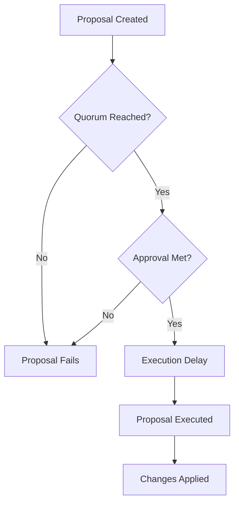

---
title: Investment Pools Governance
description: Share-weighted voting system for pool management
---

# Investment Pools Governance

## Overview

Investment pools use a **weighted voting system** where voting power equals share ownership. This ensures those with more "skin in the game" have proportional influence.

```
Voting Power = Number of Shares Owned
1 Share = 1 Vote
```

---

## How Pool Governance Works

### Share-Based Voting

Unlike traditional DAOs (1 member = 1 vote), investment pools use:

```typescript
const votingPower = {
  user1: {
    shares: 100,
    votingPower: 100, // 10% of pool
    influence: "10%"
  },
  user2: {
    shares: 50,
    votingPower: 50, // 5% of pool
    influence: "5%"
  },
  totalShares: 1000
};
```

### Delegation

Share holders can delegate voting power:

```typescript
const delegation = {
  delegator: "user1",
  delegate: "user2",
  delegatedShares: 100,
  
  // Voting power after delegation
  user1VotingPower: 100 - 100 = 0, // Delegated away
  user2VotingPower: 50 + 100 = 150 // Received delegation
};
```

---

## Proposal Types

### 1. **Allocation Changes**

Modify asset allocations in the pool:

```typescript
const allocationProposal = {
  title: "Reduce BTC to 40%, Increase ETH to 60%",
  type: "allocation_change",
  currentAllocation: [
    { symbol: "BTC", allocation: 5000 },
    { symbol: "ETH", allocation: 5000 }
  ],
  proposedAllocation: [
    { symbol: "BTC", allocation: 4000 },
    { symbol: "ETH", allocation: 6000 }
  ],
  reason: "ETH has better fundamentals currently"
};
```

**Voting Requirements**:
- **Quorum**: 30% of shares must vote
- **Approval**: 60% of votes must approve
- **Execution Delay**: 24 hours after approval

### 2. **Fee Changes**

Adjust performance or management fees:

```typescript
const feeProposal = {
  title: "Reduce Performance Fee to 1%",
  type: "fee_change",
  currentFees: {
    performanceFee: 200, // 2%
    managementFee: 200   // 2%
  },
  proposedFees: {
    performanceFee: 100, // 1%
    managementFee: 200   // unchanged
  }
};
```

**Voting Requirements**:
- **Quorum**: 40% (higher for fee changes)
- **Approval**: 66% supermajority
- **Execution Delay**: 7 days (allows withdrawals)

### 3. **Manager Changes**

Add or remove pool managers:

```typescript
const managerProposal = {
  title: "Add Alice as Pool Manager",
  type: "add_manager",
  newManager: "0x742d35Cc...",
  permissions: [
    "rebalance",
    "update_settings",
    "execute_trades"
  ]
};
```

**Voting Requirements**:
- **Quorum**: 50%
- **Approval**: 75% supermajority
- **Execution**: Immediate after approval

### 4. **Strategy Changes**

Enable/disable DeFi strategies:

```typescript
const strategyProposal = {
  title: "Enable Ubeswap Liquidity Mining",
  type: "enable_strategy",
  strategy: {
    protocol: "Ubeswap",
    action: "provide_liquidity",
    allocation: 2000, // 20% of pool
    expectedAPY: "15%",
    risk: "medium"
  }
};
```

**Voting Requirements**:
- **Quorum**: 40%
- **Approval**: 60%
- **Execution Delay**: 48 hours

### 5. **Emergency Actions**

Pause pool during crisis:

```typescript
const emergencyProposal = {
  title: "Emergency Pause Pool",
  type: "emergency_pause",
  reason: "Smart contract vulnerability detected",
  actions: [
    "pause_deposits",
    "pause_withdrawals",
    "freeze_rebalancing"
  ]
};
```

**Fast-Track Voting**:
- **Quorum**: 20% (lower for emergencies)
- **Approval**: 50%
- **Execution**: Immediate
- **Duration**: 7 days max, then auto-resume

---

## Creating a Proposal

### Step-by-Step

```typescript
// 1. Calculate your voting power
const myVotingPower = await fetch(`/api/investment-pools/${poolId}/voting-power`, {
  headers: { 'Authorization': `Bearer ${token}` }
});

// 2. Create proposal
const proposal = await fetch(`/api/investment-pools/${poolId}/proposals`, {
  method: 'POST',
  headers: { 'Content-Type': 'application/json' },
  body: JSON.stringify({
    title: "Reduce BTC allocation to 40%",
    description: "ETH has stronger fundamentals...",
    type: "allocation_change",
    proposedChanges: {
      btcAllocation: 4000,
      ethAllocation: 6000
    },
    votingDuration: 7 // days
  })
});

// 3. Proposal enters voting period
const { proposalId } = await proposal.json();
```

### Proposal Requirements

| Requirement | Value |
|-------------|-------|
| **Min Voting Power** | 1% of total shares |
| **Proposal Bond** | 100 MTAA tokens (refunded if passed) |
| **Cooldown Period** | 3 days between proposals |

---

## Voting on Proposals

### Casting a Vote

```typescript
const vote = await fetch(`/api/pool-governance/${proposalId}/vote`, {
  method: 'POST',
  body: JSON.stringify({
    vote: "for", // "for", "against", "abstain"
    reason: "I believe ETH will outperform BTC" // optional
  })
});

// Your voting power is automatically calculated
const response = await vote.json();
console.log(`Voted with ${response.votingPower} shares`);
```

### Vote Delegation

```typescript
// Delegate your votes to another user
await fetch(`/api/pool-governance/${poolId}/delegate`, {
  method: 'POST',
  body: JSON.stringify({
    delegateAddress: "0x742d35Cc...",
    shares: 100, // Partial or full delegation
    duration: 30 // days, 0 = permanent
  })
});

// Revoke delegation
await fetch(`/api/pool-governance/${poolId}/revoke-delegation`, {
  method: 'POST'
});
```

---

## Proposal Lifecycle



### States

```typescript
type ProposalStatus = 
  | "active"      // Voting in progress
  | "passed"      // Approved, awaiting execution
  | "rejected"    // Failed to meet quorum or approval
  | "executed"    // Changes applied
  | "cancelled";  // Cancelled by creator

const proposal = {
  id: "prop_123",
  status: "active",
  votingEnds: "2025-12-15T00:00:00Z",
  votesFor: 450,      // 45% of shares
  votesAgainst: 100,  // 10%
  votesAbstain: 50,   // 5%
  totalVotes: 600,    // 60% turnout
  quorum: 300,        // 30% required
  approval: 600,      // 60% required
  outcome: {
    quorumReached: true,  // 60% > 30%
    approvalReached: true // 75% approval > 60%
  }
};
```

---

## Voting Power Calculation

### Basic Formula

```typescript
const calculateVotingPower = (
  userShares: number,
  delegatedToUser: number,
  delegatedByUser: number
): number => {
  return userShares - delegatedByUser + delegatedToUser;
};

// Example
const votingPower = {
  ownedShares: 100,
  delegatedOut: 20,   // You delegated 20 to others
  delegatedIn: 50,    // Others delegated 50 to you
  effectivePower: 100 - 20 + 50 = 130 votes
};
```

### Share Percentage

```typescript
const sharePercentage = (votingPower / totalShares) * 100;

// Example
const influence = {
  yourVotingPower: 130,
  totalShares: 1000,
  yourInfluence: (130 / 1000) * 100 = 13%
};
```

---

## Governance Settings

### Adjustable Parameters

Pool managers can propose changes to:

```typescript
const governanceSettings = {
  quorumPercentage: 3000,        // 30% (basis points)
  approvalThreshold: 6000,       // 60%
  votingDuration: 7,             // days
  executionDelay: 24,            // hours
  proposalBond: "100",           // MTAA tokens
  minVotingPower: 100,           // 1% of shares
  delegationAllowed: true,
  voteChangingAllowed: false     // Can't change vote
};
```

### Emergency Settings

```typescript
const emergencySettings = {
  quorumPercentage: 2000,   // 20% (lower)
  approvalThreshold: 5000,  // 50% (lower)
  votingDuration: 1,        // 1 day (faster)
  executionDelay: 0,        // Immediate
  pauseDuration: 7          // Max pause duration
};
```

---

## Voting Analytics

### Proposal History

```typescript
const analytics = {
  totalProposals: 24,
  passed: 18,
  rejected: 4,
  cancelled: 2,
  passRate: "75%",
  
  avgTurnout: "62%",
  avgApproval: "78%",
  
  proposalTypes: {
    allocation_change: 10,
    fee_change: 3,
    manager_change: 2,
    strategy_change: 7,
    emergency: 2
  }
};
```

### Voter Participation

```typescript
const participation = {
  activeVoters: 45,      // Voted in last 30 days
  totalInvestors: 67,
  participationRate: "67%",
  
  topVoters: [
    { address: "0x...", votes: 12, power: "8.5%" },
    { address: "0x...", votes: 11, power: "6.2%" }
  ]
};
```

---

## Best Practices

### For Proposers

1. **Research First**: Understand current allocations and market conditions
2. **Clear Rationale**: Explain why the change benefits all investors
3. **Gradual Changes**: Don't propose extreme allocation shifts
4. **Engage Community**: Discuss in pool chat before proposing
5. **Timing Matters**: Don't propose during high volatility

### For Voters

1. **Educate Yourself**: Understand what you're voting on
2. **Check Conflicts**: Ensure proposer doesn't have conflicts of interest
3. **Vote Your Shares**: Use your voting power
4. **Delegate Wisely**: Only delegate to trusted, active members
5. **Monitor Execution**: Verify proposals execute as described

### For Pool Managers

1. **Transparency**: Share performance data regularly
2. **Communication**: Explain rebalancing decisions
3. **Risk Management**: Don't take unnecessary risks
4. **Respect Governance**: Follow approved proposals
5. **Emergency Protocol**: Have clear emergency procedures

---

## Security Measures

### Proposal Safety

```typescript
const safetyChecks = {
  bondRequirement: "100 MTAA", // Spam prevention
  cooldownPeriod: 3, // days between proposals
  allocationLimits: {
    minPerAsset: 1000, // 10%
    maxPerAsset: 9000  // 90%
  },
  feeChangeLimits: {
    maxIncrease: 500,  // Can't increase >5% at once
    minDecrease: 0     // No limit on decreases
  }
};
```

### Vote Manipulation Prevention

- ✅ **Snapshot Voting**: Voting power calculated at proposal creation
- ✅ **No Vote Buying**: Shares transferred after snapshot don't count
- ✅ **Delegation Limits**: Max 50% of shares can be delegated
- ✅ **Timelock**: 24-hour delay before execution

---

## API Reference

### Get Voting Power

```typescript
GET /api/investment-pools/:id/voting-power

Response: {
  userId: string;
  ownedShares: number;
  delegatedToUser: number;
  delegatedByUser: number;
  effectiveVotingPower: number;
  sharePercentage: number;
}
```

### Create Proposal

```typescript
POST /api/investment-pools/:id/proposals

Body: {
  title: string;
  description: string;
  type: "allocation_change" | "fee_change" | "manager_change" | "strategy_change" | "emergency_pause";
  proposedChanges: object;
  votingDuration: number; // days
}

Response: {
  proposalId: string;
  votingEnds: string;
  quorumRequired: number;
  approvalRequired: number;
}
```

### Cast Vote

```typescript
POST /api/pool-governance/:proposalId/vote

Body: {
  vote: "for" | "against" | "abstain";
  reason?: string;
}

Response: {
  voteId: string;
  votingPower: number;
  currentTally: {
    for: number;
    against: number;
    abstain: number;
  };
}
```

---

## Coming Soon

- ✅ **Quadratic Voting**: Reduce whale influence
- ✅ **Conviction Voting**: Lock tokens for stronger votes
- ✅ **Snapshot Integration**: Off-chain gasless voting
- ✅ **AI Proposal Analysis**: Automated risk assessment

---

## Support

Need help with pool governance?

- **Documentation**: [docs.mtaadao.com](https://docs.mtaadao.com)
- **Discord**: Join #pool-governance channel
- **Email**: governance@mtaadao.com
