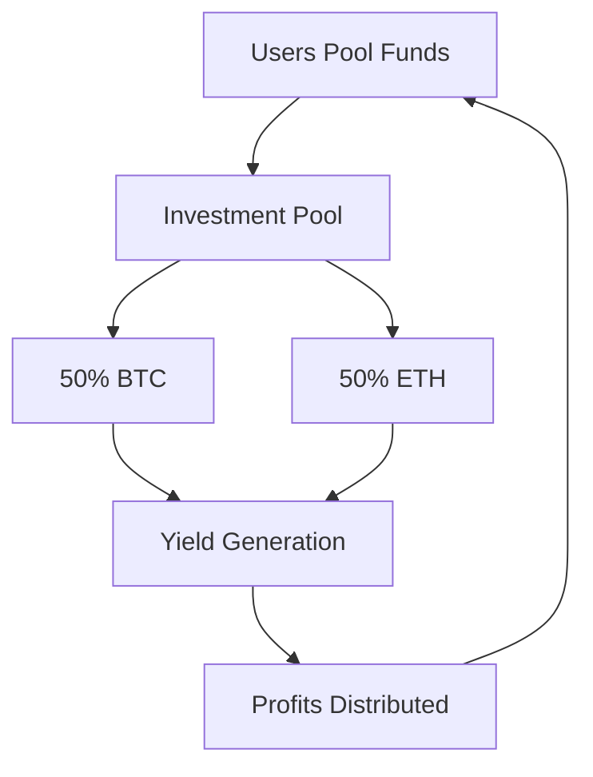
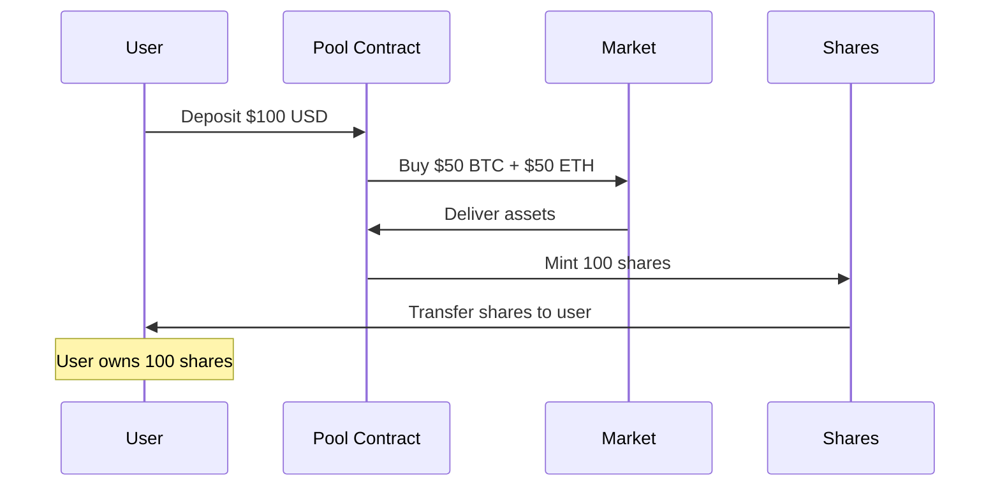

---
title: Investment Pools
description: Multi-asset crypto investment pools with shared governance
---

# Investment Pools - Crypto Chama

## Overview

Investment Pools allow groups to pool funds and invest in multiple cryptocurrencies together. Built on Celo, these pools enable collective crypto investing with transparent governance.



---

## How Investment Pools Work

### Share-Based Ownership

Investment pools use **ERC20 share tokens** to represent ownership:

```typescript
// User invests $100 into pool with $1000 TVL and 1000 shares
const investment = {
  usdAmount: 100,
  poolTVL: 1000,
  totalShares: 1000,
  sharesReceived: (100 * 1000) / 1000 = 100 shares
};

// Pool value increases to $1100
const newSharePrice = 1100 / 1000 = $1.10 per share;
const userValue = 100 * 1.10 = $110; // $10 profit!
```

### Asset Allocation

Pools automatically split investments across multiple assets:

```typescript
const poolConfig = {
  name: "Crypto Pioneers Pool",
  assets: [
    { symbol: "BTC", allocation: 5000 }, // 50% (basis points)
    { symbol: "ETH", allocation: 5000 }  // 50%
  ],
  totalAllocation: 10000 // Must equal 100%
};
```

---

## Pool Types

### 1. **Standard 50/50 Pools** (Phase 1 - Live)

Current implementation splits equally between BTC and ETH:

| Feature | Details |
|---------|---------|
| **Assets** | Wrapped BTC + Wrapped ETH on Celo |
| **Allocation** | 50% BTC, 50% ETH (fixed) |
| **Min Investment** | $10 USD |
| **Performance Fee** | 2% annually |
| **Rebalancing** | Automated (every 6 hours) |

**Example Pool**:
```json
{
  "id": "pool_001",
  "name": "Balanced Crypto Fund",
  "tvl": "$50,000",
  "sharePrice": "$1.25",
  "investors": 45,
  "24hReturn": "+3.2%",
  "30dReturn": "+18.7%"
}
```

### 2. **Custom Allocation Pools** (Phase 2 - Q1 2026)

Flexible multi-asset pools:

```typescript
const customPool = {
  assets: [
    { symbol: "BTC", allocation: 4000 },  // 40%
    { symbol: "ETH", allocation: 3000 },  // 30%
    { symbol: "SOL", allocation: 2000 },  // 20%
    { symbol: "MATIC", allocation: 1000 } // 10%
  ]
};
```

### 3. **Strategy Pools** (Phase 3 - Q2 2026)

Pools with active DeFi strategies:

- **Yield Farming Pools**: Stake assets in DeFi protocols
- **Liquidity Pools**: Provide liquidity on DEXs
- **Staking Pools**: Stake proof-of-stake tokens
- **Arbitrage Pools**: Automated trading strategies

---

## Creating an Investment Pool

### Step 1: Pool Setup

```typescript
const newPool = {
  daoId: "dao_123",
  name: "Youth Crypto Investment Club",
  symbol: "YCIC", // Share token symbol
  description: "A pool for young investors to learn and earn together",
  minimumInvestment: "10", // $10 USD
  performanceFee: 200, // 2% (basis points)
  assets: [
    { symbol: "BTC", allocation: 5000 },
    { symbol: "ETH", allocation: 5000 }
  ]
};

const response = await fetch('/api/investment-pools/create', {
  method: 'POST',
  headers: { 'Content-Type': 'application/json' },
  body: JSON.stringify(newPool)
});
```

### Step 2: Initial Deposit

Pool creators should seed the pool:

```typescript
await fetch(`/api/investment-pools/${poolId}/invest`, {
  method: 'POST',
  body: JSON.stringify({
    amountUsd: 100, // Initial seed
  })
});
```

### Step 3: Invite Members

Share pool link with your DAO or community:

```
https://mtaadao.com/investment-pools/pool_123
```

---

## Investing in a Pool

### Investment Flow



### Code Example

```typescript
const invest = async (poolId: string, amountUsd: number) => {
  const response = await fetch(`/api/investment-pools/${poolId}/invest`, {
    method: 'POST',
    headers: { 'Content-Type': 'application/json' },
    body: JSON.stringify({ amountUsd })
  });
  
  const { investment } = await response.json();
  
  console.log(`
    Invested: $${investment.usdValue}
    Shares Received: ${investment.sharesMinted}
    Share Price: $${investment.sharePrice}
  `);
};
```

---

## Withdrawing from a Pool

### Withdrawal Process

```typescript
const withdraw = async (poolId: string, shares: number) => {
  const response = await fetch(`/api/investment-pools/${poolId}/withdraw`, {
    method: 'POST',
    headers: { 'Content-Type': 'application/json' },
    body: JSON.stringify({ shares })
  });
  
  const { withdrawal } = await response.json();
  
  console.log(`
    Shares Burned: ${withdrawal.sharesBurned}
    USD Received: $${withdrawal.usdValue}
    Performance Fee: $${withdrawal.performanceFee}
    Net Amount: $${withdrawal.netAmount}
  `);
};
```

### Fee Calculation

```typescript
// Example withdrawal with profit
const withdrawal = {
  shares: 100,
  sharePrice: 1.25, // Pool grew 25%
  grossValue: 100 * 1.25 = 125,
  
  // Performance fee only on profit
  profit: 125 - 100 = 25,
  performanceFee: 25 * 0.02 = 0.50, // 2% of profit
  
  netAmount: 125 - 0.50 = 124.50 // What you receive
};
```

---

## Automated Rebalancing

### How It Works

Pools automatically rebalance to maintain target allocations:

```typescript
// Initial state: 50/50 BTC/ETH
const initialState = {
  btc: { value: 500, allocation: 50% },
  eth: { value: 500, allocation: 50% },
  total: 1000
};

// After price changes
const afterPriceChange = {
  btc: { value: 600, allocation: 54.5% }, // BTC up 20%
  eth: { value: 500, allocation: 45.5% }, // ETH flat
  total: 1100
};

// Rebalancer sells BTC, buys ETH
const rebalanced = {
  btc: { value: 550, allocation: 50% },
  eth: { value: 550, allocation: 50% },
  total: 1100 // Total value unchanged
};
```

### Rebalancing Triggers

Automatic rebalancing occurs when:

1. **Threshold Exceeded**: Allocation drifts >5% from target
2. **Scheduled Time**: Every 6 hours (default)
3. **Manual Trigger**: Pool manager initiates rebalance

### Rebalancing Settings

```typescript
const settings = {
  poolId: "pool_123",
  rebalanceThreshold: 500, // 5% drift (basis points)
  rebalanceFrequency: "6h",
  maxSlippage: 50, // 0.5% max price impact
  minRebalanceValue: "100" // Don't rebalance <$100 changes
};
```

---

## Performance Tracking

### Daily Snapshots

System records pool performance every hour:

```typescript
interface PoolSnapshot {
  poolId: string;
  timestamp: Date;
  totalValueUsd: string;
  sharePrice: string;
  assetBalances: {
    btcBalance: string;
    ethBalance: string;
  };
  assetPrices: {
    btcPriceUsd: number;
    ethPriceUsd: number;
  };
}
```

### Performance Metrics

```typescript
const performance = {
  "24h": {
    return: "+3.2%",
    volume: "$5,420"
  },
  "7d": {
    return: "+8.7%",
    volume: "$34,200"
  },
  "30d": {
    return: "+18.5%",
    volume: "$142,000"
  },
  "allTime": {
    return: "+45.2%",
    totalInvested: "$500,000"
  }
};
```

### Performance API

```typescript
GET /api/investment-pools/:id/performance-chart?days=30

Response: {
  dataPoints: [
    { date: "2025-01-01", sharePrice: 1.00, tvl: 10000 },
    { date: "2025-01-02", sharePrice: 1.02, tvl: 10200 },
    // ... 28 more days
    { date: "2025-01-30", sharePrice: 1.25, tvl: 12500 }
  ]
}
```

---

## Pool Governance

See [Investment Pools Governance](./investment-pools-governance.mdx) for detailed governance documentation.

### Quick Overview

Investment pools use **weighted voting** where:

```
Voting Power = Number of Shares Owned
```

**Governance Actions**:
- Change asset allocations
- Adjust performance fees
- Update rebalancing settings
- Add/remove pool managers
- Emergency pause pool

---

## Risk Management

### Asset Price Risk

Crypto prices are volatile:

```typescript
const riskExample = {
  scenario: "BTC crashes 30% in one day",
  poolImpact: {
    btcValue: 500 * 0.70 = 350, // -30%
    ethValue: 500, // unchanged
    totalValue: 850,
    loss: -15% // Pool loses 15% (50% exposure to BTC)
  }
};
```

### Smart Contract Risk

All pools undergo:
- ✅ **Code Audits**: Third-party security reviews
- ✅ **Test Coverage**: 95%+ test coverage
- ✅ **Bug Bounty**: Up to $50,000 for critical bugs
- ✅ **Gradual Rollout**: TVL caps during beta

### Liquidity Risk

Withdrawal limits during high volatility:

```typescript
const withdrawalLimits = {
  standard: "No limit", // Normal conditions
  highVolatility: "10% of TVL per day", // Market stress
  emergency: "Pool paused" // Extreme conditions
};
```

---

## Fee Structure

### Performance Fees

Charged only on **profits**, not deposits:

```typescript
const feeCalculation = {
  initialInvestment: 1000,
  finalValue: 1250,
  profit: 250,
  performanceFee: 250 * 0.02 = 5, // 2% of profit
  userReceives: 1250 - 5 = 1245
};
```

### Management Fees

Annual fee deducted from pool value:

```typescript
const managementFee = {
  poolTVL: 100000,
  annualRate: 0.02, // 2%
  dailyFee: (100000 * 0.02) / 365 = 5.48,
  monthlyFee: (100000 * 0.02) / 12 = 166.67
};
```

### Fee Limits

| Fee Type | Max Rate | Default |
|----------|----------|---------|
| **Performance** | 20% | 2% |
| **Management** | 5% annual | 2% annual |
| **Deposit** | 0% | Free |
| **Withdrawal** | 0% | Free |

---

## Analytics Dashboard

### Pool Metrics

```typescript
const analytics = {
  overview: {
    tvl: "$125,000",
    investors: 67,
    avgInvestment: "$1,865",
    sharePrice: "$1.25"
  },
  performance: {
    "24h": "+3.2%",
    "7d": "+8.7%",
    "30d": "+18.5%",
    "ytd": "+45.2%"
  },
  allocation: {
    btc: { value: "$62,500", percent: "50%" },
    eth: { value: "$62,500", percent: "50%" }
  },
  activity: {
    deposits: { count: 24, volume: "$12,400" },
    withdrawals: { count: 8, volume: "$3,200" }
  }
};
```

### Investor Breakdown

```typescript
const investorStats = {
  bySize: {
    whales: { count: 3, holdings: ">$10,000" },
    dolphins: { count: 12, holdings: "$1,000-$10,000" },
    fish: { count: 52, holdings: "<$1,000" }
  },
  retention: {
    "30day": "89%", // Still invested after 30 days
    "90day": "76%"
  }
};
```

---

## API Reference

### Create Pool

```typescript
POST /api/investment-pools/create

Body: {
  daoId: string;
  name: string;
  symbol: string;
  description: string;
  minimumInvestment: string;
  performanceFee: number; // basis points
  assets: Array<{
    symbol: string;
    allocation: number; // basis points
  }>;
}

Response: {
  pool: {
    id: string;
    name: string;
    sharePrice: "1.00";
    tvl: "0";
  }
}
```

### Invest

```typescript
POST /api/investment-pools/:id/invest

Body: {
  amountUsd: number;
}

Response: {
  investment: {
    id: string;
    sharesMinted: string;
    sharePrice: string;
    usdValue: string;
  }
}
```

### Withdraw

```typescript
POST /api/investment-pools/:id/withdraw

Body: {
  shares: number;
}

Response: {
  withdrawal: {
    sharesBurned: string;
    usdValue: string;
    performanceFee: string;
    netAmount: string;
  }
}
```

---

## Coming Soon

### Phase 2 (Q1 2026)
- ✅ **Multi-Asset Support**: Add SOL, MATIC, AVAX
- ✅ **Custom Allocations**: Set your own percentages
- ✅ **Strategy Templates**: Pre-built allocation strategies

### Phase 3 (Q2 2026)
- ✅ **DeFi Integration**: Stake assets for extra yield
- ✅ **Lending Pools**: Lend assets to earn interest
- ✅ **NFT Pools**: Invest in curated NFT collections

### Phase 4 (Q3 2026)
- ✅ **Cross-Chain Pools**: Assets across multiple blockchains
- ✅ **Algorithmic Trading**: AI-powered rebalancing
- ✅ **Insurance Coverage**: Protect against smart contract risk

---

## Best Practices

1. **Diversify**: Don't put all funds in one pool
2. **Long-Term Focus**: Crypto is volatile, invest for 6+ months
3. **Understand Fees**: Know how performance fees work
4. **Monitor Performance**: Check pool metrics weekly
5. **Start Small**: Test with minimum investment first
6. **Governance Participation**: Vote on pool proposals

---

## Support

Need help with Investment Pools?

- **Documentation**: [docs.mtaadao.com](https://docs.mtaadao.com)
- **Discord**: Join our community
- **Email**: support@mtaadao.com
- **Video Tutorial**: [Watch on YouTube](#)
