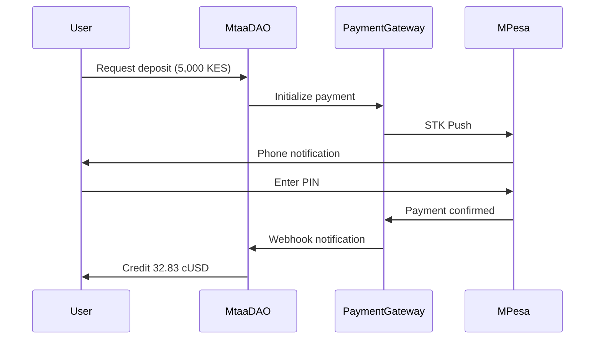

---
title: Mobile Money Integration
description: Seamless crypto-to-mobile-money conversion for African users
---

# Mobile Money Integration

Bridge the gap between cryptocurrency and traditional mobile money services.

---

## Overview

MtaaDAO integrates with major mobile money providers across Africa:
- 📱 **M-Pesa** (Kenya, Tanzania, Uganda)
- 📱 **MTN Mobile Money** (Ghana, Nigeria, Uganda)
- 📱 **Airtel Money** (Kenya, Tanzania, Uganda, Zambia)
- 📱 **Vodafone Cash** (Ghana)

---

## Supported Services

### Kenya

**M-Pesa**:
```typescript
{
  provider: "M-Pesa",
  countries: ["Kenya"],
  currencies: ["KES"],
  limits: {
    minDeposit: "100 KES",
    maxDeposit: "150,000 KES",
    minWithdrawal: "50 KES",
    maxWithdrawal: "70,000 KES"
  },
  fees: {
    deposit: "1.5%",
    withdrawal: "2.0%"
  }
}
```

---

## How It Works

### Deposit (Fiat → Crypto)

**Step 1**: Select M-Pesa Deposit
```typescript
POST /api/payment-gateway/deposit
{
  "provider": "mpesa",
  "amount": "5000", // KES
  "phone": "+254712345678"
}
```

**Step 2**: STK Push Sent
```
📱 M-Pesa Notification:
   Pay KES 5,000 to MtaaDAO
   Enter PIN to confirm
```

**Step 3**: Automatic Conversion
```
Received: 5,000 KES
Fee: 75 KES (1.5%)
Net: 4,925 KES

Exchange Rate: 1 cUSD = 150 KES
Converted: 32.83 cUSD

Credited to wallet: 32.83 cUSD
```

---

### Withdrawal (Crypto → Fiat)

**Step 1**: Request Withdrawal
```typescript
POST /api/payment-gateway/withdraw
{
  "provider": "mpesa",
  "amount": "30", // cUSD
  "phone": "+254712345678"
}
```

**Step 2**: Conversion Calculation
```
Amount: 30 cUSD
Exchange Rate: 1 cUSD = 150 KES
Gross: 4,500 KES
Fee: 90 KES (2%)
Net Payout: 4,410 KES
```

**Step 3**: M-Pesa Transfer
```
📱 M-Pesa Confirmation:
   You have received KES 4,410
   from MtaaDAO
   Transaction ID: ABC123XYZ
```

---

## Payment Flow



---

## Fee Structure

### Deposit Fees

| Provider | Base Fee | Platform Fee | Total |
|----------|----------|--------------|-------|
| M-Pesa | 0% | 1.5% | 1.5% |
| MTN MM | 0% | 1.5% | 1.5% |
| Airtel Money | 0% | 1.5% | 1.5% |

### Withdrawal Fees

| Provider | Network Fee | Platform Fee | Total |
|----------|-------------|--------------|-------|
| M-Pesa | 1% | 1% | 2% |
| MTN MM | 1% | 1% | 2% |
| Airtel Money | 1% | 1% | 2% |

---

## Exchange Rates

**Real-Time Rates**:
```typescript
GET /api/payment-gateway/rates

Response: {
  KES_to_cUSD: 0.00667, // 1 KES = 0.00667 cUSD
  cUSD_to_KES: 150,     // 1 cUSD = 150 KES
  lastUpdate: "2025-01-15T10:30:00Z",
  source: "Binance P2P average"
}
```

**Rate Sources**:
- Binance P2P
- LocalBitcoins
- Paxful
- Internal liquidity pool

---

## Transaction Limits

### Daily Limits

**Per Transaction**:
```
Minimum Deposit: 100 KES (~0.67 cUSD)
Maximum Deposit: 150,000 KES (~1,000 cUSD)

Minimum Withdrawal: 50 KES (~0.33 cUSD)
Maximum Withdrawal: 70,000 KES (~467 cUSD)
```

**Daily Caps**:
```
Unverified Users:
- Deposits: 500,000 KES/day
- Withdrawals: 300,000 KES/day

KYC Verified Users:
- Deposits: Unlimited
- Withdrawals: 1,000,000 KES/day
```

---

## Phone Number Mapping

### Link Phone to Wallet

**First-Time Setup**:
```typescript
POST /api/phone-verification/link
{
  "phone": "+254712345678",
  "walletAddress": "0xUserWallet"
}

// OTP sent via SMS
POST /api/phone-verification/verify
{
  "phone": "+254712345678",
  "otp": "123456"
}
```

**Benefits**:
- ✅ Send crypto using phone numbers
- ✅ Receive payments to phone
- ✅ Automatic M-Pesa withdrawals
- ✅ No wallet address needed

---

## Use Cases

### 1. Freelancer Payments

**Scenario**: Alice in Nairobi earns cUSD from remote work

```
Alice completes task: +100 cUSD
Withdrawal to M-Pesa:
  100 cUSD → 15,000 KES
  Fee: 300 KES
  Received: 14,700 KES

Time: 5 minutes
```

---

### 2. Cross-Border Remittances

**Scenario**: Bob in US sends money to family in Kenya

```
Traditional:
  Send: $100 USD
  Western Union fee: $12
  Exchange rate markup: $5
  Received: ~13,500 KES
  Time: 1-3 days

MtaaDAO:
  Send: 100 cUSD
  Platform fee: $2
  Exchange rate: Market
  Received: ~14,700 KES
  Time: 5 minutes

Savings: $15 (13%)
```

---

### 3. DAO Treasury Cash-Out

**Scenario**: Community DAO needs to pay local vendors

```
DAO holds: 50,000 cUSD
Withdrawal: 10,000 cUSD
Converted: 1,500,000 KES
Distributed to 10 vendors: 150,000 KES each

All via M-Pesa automatically
```

---

## API Reference

### Initialize Deposit

```typescript
POST /api/payment-gateway/deposit
{
  "provider": "mpesa",
  "amount": "5000",
  "phone": "+254712345678",
  "currency": "KES"
}

Response: {
  transactionId: "txn_abc123",
  status: "pending",
  expectedAmount: "32.83 cUSD",
  expiresAt: "2025-01-15T11:00:00Z"
}
```

### Check Transaction Status

```typescript
GET /api/payment-gateway/status/:transactionId

Response: {
  status: "completed",
  amountDeposited: "5000 KES",
  amountCredited: "32.83 cUSD",
  fee: "75 KES",
  completedAt: "2025-01-15T10:35:00Z"
}
```

### Request Withdrawal

```typescript
POST /api/payment-gateway/withdraw
{
  "provider": "mpesa",
  "amount": "30",
  "phone": "+254712345678",
  "currency": "cUSD"
}

Response: {
  transactionId: "txn_def456",
  estimatedPayout: "4,410 KES",
  fee: "90 KES",
  eta: "5 minutes"
}
```

---

## Security Features

**Anti-Fraud**:
```typescript
const securityChecks = {
  phoneVerification: true,
  velocityLimits: {
    maxTransactionsPerHour: 5,
    maxDailyValue: "500,000 KES"
  },
  suspiciousActivity: {
    newPhoneNumber: "Manual review",
    largeAmount: "KYC required",
    rapidTransactions: "Temporary block"
  }
};
```

**KYC Requirements**:
```
< 100,000 KES/day: No KYC
100,000 - 500,000 KES/day: Basic KYC (ID upload)
> 500,000 KES/day: Full KYC (video verification)
```

---

## Troubleshooting

### Common Issues

**1. STK Push Not Received**

**Causes**:
- Phone off/no signal
- M-Pesa service down
- Incorrect phone number

**Solutions**:
- Check phone number format
- Retry in 5 minutes
- Contact support if persistent

---

**2. Payment Confirmed but No cUSD**

**Causes**:
- Webhook delay
- Exchange rate volatility
- Processing queue

**Solutions**:
- Wait 5-10 minutes
- Check transaction history
- Contact support with M-Pesa confirmation

---

**3. Withdrawal Pending**

**Causes**:
- Insufficient liquidity
- KYC verification needed
- Unusual activity flagged

**Solutions**:
- Complete KYC
- Wait for manual review (< 1 hour)
- Split into smaller amounts

---

## Support

Mobile money questions?

- **WhatsApp**: +254700000000
- **Email**: mpesa@mtaadao.com
- **Telegram**: @MtaaDAOSupport

---

**Available 24/7** | Response time: < 30 minutes
