# Phone Number Payments

## Send Money Using Phone Numbers

MtaaDAO leverages Celo's **phone number mapping** to enable seamless crypto payments using just a phone number—no wallet addresses needed.

---

## How It Works


---

## Phone Number Mapping

### What is Phone Mapping?

Celo's Attestation Protocol links phone numbers to blockchain addresses, creating a decentralized identity system.

**Example**:
```
Phone: +254712345678
     ↓ (Celo Attestation)
Address: 0x742d35Cc6634C0532925a3b844D9eAB0F8b8dF2e
```

### Verification Process

1. **User registers** phone number in MtaaDAO
2. **Celo sends SMS** with verification code
3. **User confirms** code in app
4. **Attestation recorded** on blockchain
5. **Phone ↔ Address mapping** is live

---

## Sending Money by Phone

### Step-by-Step

**1. Open Wallet**
```
Navigate to /wallet → Click "Send"
```

**2. Choose Phone Number Method**
```typescript
// UI Selection
const sendMethod = "phone_number"; // vs "wallet_address"
```

**3. Enter Details**
```
Phone Number: +254712345678
Amount: 500 cUSD
Currency: cUSD (default)
```

**4. Confirm Transaction**
```
Review:
To: +254712345678 (Jane Kamau)
Amount: 500 cUSD
Fee: ~$0.001 (gas)

[Confirm Send]
```

**5. Recipient Gets Notified**
```sms
MtaaDAO: You received 500 cUSD from John.
Check your wallet: app.mtaadao.com
```

---

## Supported Country Codes

| Region | Country Code | Example | Status |
|--------|--------------|---------|--------|
| **Kenya** | +254 | +254712345678 | ✅ Active |
| **Uganda** | +256 | +256700123456 | ✅ Active |
| **Tanzania** | +255 | +255678123456 | ✅ Active |
| **Nigeria** | +234 | +2348012345678 | 🚧 Coming Q1 2026 |
| **Ghana** | +233 | +233201234567 | 🚧 Coming Q1 2026 |
| **South Africa** | +27 | +27821234567 | 🚧 Coming Q2 2026 |

---

## Features

### SMS Notifications

Recipients receive instant SMS alerts:

```sms
MtaaDAO Alert
You received 1,000 cUSD from @johndoe
Sender note: "Rent payment for January"
View: app.mtaadao.com/wallet
```

### Contact Book Integration

Save frequent recipients:

```typescript
const contacts = [
  { name: "Mom", phone: "+254700111222", verified: true },
  { name: "Landlord", phone: "+254733444555", verified: true },
  { name: "Business Partner", phone: "+256700666777", verified: false }
];
```

### Request Money by Phone

```typescript
// Create payment request
const request = {
  from: "+254712345678",
  amount: "2000",
  currency: "cUSD",
  reason: "Splitting dinner bill",
  expiry: "24 hours"
};

// Send via SMS
sendSMS(request.from, `
  ${user.name} requests 2000 cUSD for: ${request.reason}
  Pay now: app.mtaadao.com/pay/${request.id}
`);
```

---

## Security Features

### Phone Verification

```mermaid
graph TD
    A[User Enters Phone] --> B[Celo Sends SMS Code]
    B --> C{Code Correct?}
    C -->|Yes| D[Phone Verified ✓]
    C -->|No| E[Retry or Contact Support]
    D --> F[Phone ↔ Address Mapping Active]
```



### Anti-Fraud Measures

🔒 **Rate Limiting**: Max 10 phone payments per day  
🔒 **Amount Caps**: Unverified: $100/day, Verified: $1,000/day  
🔒 **Duplicate Detection**: Prevents accidental re-sends  
🔒 **Recipient Confirmation**: Optional 2FA for large amounts

---

## API Integration

### Send to Phone Number

```typescript
// Frontend API call
const response = await fetch('/api/wallet/send-to-phone', {
  method: 'POST',
  headers: { 'Content-Type': 'application/json' },
  body: JSON.stringify({
    fromAddress: userWallet.address,
    phoneNumber: '+254712345678',
    amount: '500',
    currency: 'cUSD'
  })
});

// Backend resolves phone to address
const recipientAddress = await resolvePhoneToAddress(phoneNumber);

// Execute blockchain transaction
await transferTokens({
  from: fromAddress,
  to: recipientAddress,
  amount: parseEther(amount)
});
```

### Lookup Phone Mapping

```typescript
async function resolvePhoneToAddress(phoneNumber: string): Promise<string> {
  const kit = newKitFromWeb3(web3);
  const accounts = await kit.contracts.getAccounts();
  
  // Query Celo registry
  const address = await accounts.getAttestationVerified(phoneNumber);
  
  if (!address) {
    throw new Error('Phone number not registered on Celo');
  }
  
  return address;
}
```

---

## User Experience Flow

### First-Time User Receiving Money

```mermaid
graph TD
    A[Receives SMS: "You got 500 cUSD"] --> B[Clicks Link]
    B --> C{Has MtaaDAO Account?}
    C -->|No| D[Sign Up with Phone]
    C -->|Yes| E[Login]
    D --> F[Verify Phone Number]
    E --> F
    F --> G[See Wallet Balance: 500 cUSD]
    G --> H[Choose Action]
    H --> I[Withdraw to M-Pesa]
    H --> J[Keep in Wallet]
    H --> K[Send to Someone Else]
```

---

## Advantages Over Traditional Methods

| Feature | M-Pesa | Bank Transfer | MtaaDAO Phone Payments |
|---------|--------|---------------|------------------------|
| **Speed** | Instant | 1-3 days | Instant |
| **Fees** | 1-5% | $2-5 | ~$0.001 |
| **Cross-Border** | Limited | High fees | Seamless |
| **Transparency** | Opaque | Opaque | Blockchain verified |
| **Accessibility** | Kenya only | Bank required | Global (phone required) |

---

## Limitations & Workarounds

### Current Limitations

❌ **Phone Must Be Verified**: Recipient must verify phone on Celo  
❌ **One Phone = One Address**: Can't link multiple wallets  
❌ **No Offline Payments**: Requires internet connection

### Planned Features

🚧 **Multi-Wallet Linking** (Q2 2026): Link work + personal wallets  
🚧 **Offline Mode** (Q3 2026): Send via USSD codes  
🚧 **Bulk Payments** (Q1 2026): Pay multiple phones at once

---

## Example Use Cases

### 1. Salary Payments

```typescript
// Employer pays 10 employees
const payroll = [
  { phone: '+254700111111', amount: '50000', name: 'Alice' },
  { phone: '+254700222222', amount: '45000', name: 'Bob' },
  // ... 8 more employees
];

// Bulk send
await bulkPayByPhone(payroll);

// All receive SMS:
// "Salary deposited: 50,000 cUSD from Acme Corp"
```

### 2. Bill Splitting

```typescript
// Dinner bill: 6,000 cUSD, 4 people
const split = {
  total: '6000',
  people: [
    { phone: '+254700111111', share: '1500' },
    { phone: '+254700222222', share: '1500' },
    { phone: '+254700333333', share: '1500' },
    { phone: '+254700444444', share: '1500' }
  ]
};

// Request payment from each
await requestSplitPayment(split);
```

### 3. Remittances

```typescript
// Send money home from abroad
const remittance = {
  from: userWallet, // Your US wallet
  toPhone: '+254700555555', // Family in Kenya
  amount: '10000', // cUSD
  note: 'Monthly support'
};

// Family receives in 5 seconds, withdraws to M-Pesa
```

---

## FAQ

**Q: What if recipient doesn't have MtaaDAO account?**  
A: They receive an SMS with signup link. Funds are held for 7 days.

**Q: Can I send to international numbers?**  
A: Yes, as long as the number is verified on Celo (currently East Africa only).

**Q: What happens if I send to wrong number?**  
A: Transactions are irreversible. Always verify before sending!

**Q: Are there daily limits?**  
A: Unverified: $100/day, Basic KYC: $1,000/day, Full KYC: $10,000/day

**Q: Can I send to a number not on Celo?**  
A: No. Recipient must verify their phone first. You'll get an error if not found.

---

## Next Steps

<div className="mt-8 grid grid-cols-1 md:grid-cols-2 gap-4">
  <a href="/features/recurring-payments" className="p-6 border rounded-lg hover:bg-gray-50">
    <h3 className="font-bold mb-2">⏰ Recurring Payments</h3>
    <p className="text-sm">Set up automatic phone number payments</p>
  </a>
  
  <a href="/features/bill-splitting" className="p-6 border rounded-lg hover:bg-gray-50">
    <h3 className="font-bold mb-2">💸 Bill Splitting</h3>
    <p className="text-sm">Split expenses with phone numbers</p>
  </a>
</div>
