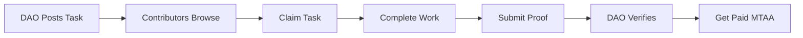
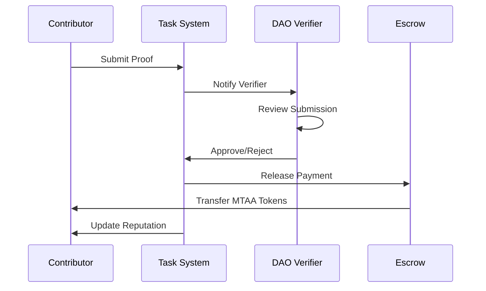

---
title: Task Marketplace & Bounties
description: Earn MTAA tokens by completing tasks and bounties
---

# Task Marketplace & Bounties

## Overview

The Task Marketplace connects DAOs with contributors. Post tasks, claim bounties, and earn MTAA tokens for your skills.



---

## How It Works

### For Task Creators (DAOs)

1. **Post a Task**: Define requirements and bounty
2. **Wait for Claims**: Contributors apply
3. **Review Submissions**: Verify completed work
4. **Release Payment**: MTAA tokens sent automatically

### For Contributors

1. **Browse Tasks**: Filter by category, difficulty, reward
2. **Claim Task**: Lock in your commitment
3. **Complete Work**: Submit proof of completion
4. **Get Paid**: Receive MTAA tokens upon approval

---

## Task Categories

### Development

```typescript
const devTasks = [
  {
    category: "Frontend Development",
    examples: [
      "Build landing page component",
      "Implement responsive design",
      "Fix UI bugs"
    ],
    avgReward: "250-1000 MTAA",
    difficulty: "easy-medium"
  },
  {
    category: "Backend Development",
    examples: [
      "Create REST API endpoint",
      "Database optimization",
      "Authentication system"
    ],
    avgReward: "500-2000 MTAA",
    difficulty: "medium-hard"
  },
  {
    category: "Smart Contract",
    examples: [
      "Write Solidity contract",
      "Security audit",
      "Gas optimization"
    ],
    avgReward: "1000-10000 MTAA",
    difficulty: "hard-expert"
  }
];
```

### Design

```typescript
const designTasks = [
  {
    category: "UI/UX Design",
    examples: [
      "Mobile app mockups",
      "User flow diagrams",
      "Redesign dashboard"
    ],
    avgReward: "200-800 MTAA"
  },
  {
    category: "Graphic Design",
    examples: [
      "Logo design",
      "Social media graphics",
      "NFT artwork"
    ],
    avgReward: "150-600 MTAA"
  }
];
```

### Content Creation

```typescript
const contentTasks = [
  {
    category: "Documentation",
    examples: [
      "API documentation",
      "User guides",
      "Tutorial videos"
    ],
    avgReward: "100-500 MTAA"
  },
  {
    category: "Marketing",
    examples: [
      "Blog posts",
      "Twitter threads",
      "Community management"
    ],
    avgReward: "50-300 MTAA"
  }
];
```

### Community

```typescript
const communityTasks = [
  {
    category: "Governance",
    examples: [
      "Vote on proposals",
      "Comment on discussions",
      "Attend DAO meetings"
    ],
    avgReward: "25-100 MTAA"
  },
  {
    category: "Testing",
    examples: [
      "Bug reporting",
      "Feature testing",
      "User feedback"
    ],
    avgReward: "50-200 MTAA"
  }
];
```

---

## Task Difficulty Levels

### Easy (1-3 hours)

```typescript
const easyTask = {
  difficulty: "easy",
  timeEstimate: "1-3 hours",
  rewardRange: "100-500 MTAA",
  requirements: [
    "Basic skills required",
    "Clear instructions provided",
    "Minimal complexity"
  ],
  examples: [
    "Write a blog post (500 words)",
    "Design a social media graphic",
    "Report bugs you find"
  ]
};
```

### Medium (4-8 hours)

```typescript
const mediumTask = {
  difficulty: "medium",
  timeEstimate: "4-8 hours",
  rewardRange: "500-2000 MTAA",
  requirements: [
    "Intermediate skills",
    "Some problem-solving",
    "Moderate complexity"
  ],
  examples: [
    "Build a React component",
    "Create API documentation",
    "Design mobile app screens"
  ]
};
```

### Hard (1-2 weeks)

```typescript
const hardTask = {
  difficulty: "hard",
  timeEstimate: "1-2 weeks",
  rewardRange: "2000-10000 MTAA",
  requirements: [
    "Advanced skills",
    "Complex problem-solving",
    "High technical knowledge"
  ],
  examples: [
    "Develop full feature",
    "Smart contract development",
    "Complete website redesign"
  ]
};
```

### Expert (1+ months)

```typescript
const expertTask = {
  difficulty: "expert",
  timeEstimate: "1+ months",
  rewardRange: "10000+ MTAA",
  requirements: [
    "Expert-level skills",
    "Architecture design",
    "Project management"
  ],
  examples: [
    "Build entire application",
    "Comprehensive security audit",
    "Design complete brand identity"
  ]
};
```

---

## Creating a Task

### Task Structure

```typescript
const task = {
  // Basic Info
  title: "Build Landing Page Component",
  description: "Create a responsive landing page...",
  category: "Frontend Development",
  difficulty: "medium",
  
  // Requirements
  requiredSkills: ["React", "TypeScript", "Tailwind CSS"],
  estimatedHours: 6,
  deadline: "2025-12-31",
  
  // Compensation
  bountyAmount: 750, // MTAA tokens
  
  // Deliverables
  deliverables: [
    "Functional React component",
    "Responsive for mobile/desktop",
    "Matches design mockup",
    "Clean, commented code"
  ],
  
  // Acceptance Criteria
  acceptanceCriteria: [
    "Passes all tests",
    "No console errors",
    "Loads in <2 seconds",
    "Accessible (WCAG AA)"
  ]
};
```

### Creating via API

```typescript
const createTask = async () => {
  const response = await fetch('/api/tasks/create', {
    method: 'POST',
    headers: { 'Content-Type': 'application/json' },
    body: JSON.stringify({
      title: "Build Landing Page Component",
      description: "...",
      reward: 750,
      daoId: "dao_123",
      category: "Frontend Development",
      difficulty: "medium",
      estimatedTime: "6 hours",
      deadline: "2025-12-31",
      requiresVerification: true
    })
  });
  
  const { task } = await response.json();
  console.log(`Task created: ${task.id}`);
};
```

---

## Claiming a Task

### Claim Process

```typescript
const claimTask = async (taskId: string) => {
  const response = await fetch(`/api/tasks/${taskId}/claim`, {
    method: 'POST',
    headers: { 'Content-Type': 'application/json' }
  });
  
  const { claim } = await response.json();
  
  console.log(`
    Task Claimed: ${claim.taskId}
    Deadline: ${claim.deadline}
    Reward: ${claim.reward} MTAA
    Status: ${claim.status}
  `);
};
```

### Claim Requirements

```typescript
const claimRequirements = {
  reputation: {
    minScore: 0,    // For easy tasks
    recommended: 100 // For medium tasks
  },
  limits: {
    maxActiveTasks: 5,     // Can claim max 5 tasks at once
    maxPerDay: 10,         // Max 10 claims per day
    cooldown: "1 hour"     // 1 hour between claims
  },
  verification: {
    emailVerified: true,
    walletConnected: true,
    profileComplete: false  // Optional
  }
};
```

---

## Submitting Proof

### Proof Requirements

```typescript
const submitProof = async (taskId: string) => {
  const proof = {
    proofUrl: "https://github.com/user/repo/pull/123",
    description: "Completed the landing page component...",
    screenshots: [
      "https://i.imgur.com/screenshot1.png",
      "https://i.imgur.com/screenshot2.png"
    ],
    additionalNotes: "Also added mobile responsiveness..."
  };
  
  const response = await fetch(`/api/tasks/${taskId}/submit`, {
    method: 'POST',
    body: JSON.stringify(proof)
  });
  
  const { submission } = await response.json();
};
```

### Proof Types by Category

| Category | Accepted Proof |
|----------|---------------|
| **Development** | GitHub PR, live demo link, code repository |
| **Design** | Figma link, image files, mockup URLs |
| **Content** | Google Docs link, published article URL |
| **Testing** | Bug report link, test results, screenshots |
| **Community** | Meeting notes, forum posts, Discord logs |

---

## Task Verification

### Verification Process



### Verification Criteria

```typescript
const verificationChecklist = {
  completeness: {
    allDeliverablesProvided: boolean;
    meetsRequirements: boolean;
    deadline: "on time" | "late" | "early";
  },
  quality: {
    followsGuidelines: boolean;
    codeQuality: "poor" | "acceptable" | "excellent";
    documentation: boolean;
  },
  functionality: {
    works: boolean;
    bugFree: boolean;
    performant: boolean;
  }
};
```

### Approval/Rejection

```typescript
// Approve submission
await fetch(`/api/tasks/${taskId}/verify`, {
  method: 'POST',
  body: JSON.stringify({
    approved: true,
    feedback: "Great work! Clean code and excellent documentation.",
    bonus: 50 // Optional bonus MTAA
  })
});

// Reject submission
await fetch(`/api/tasks/${taskId}/verify`, {
  method: 'POST',
  body: JSON.stringify({
    approved: false,
    feedback: "Missing mobile responsiveness. Please revise.",
    allowResubmission: true
  })
});
```

---

## Payment & Rewards

### Payment Flow

```typescript
const paymentFlow = {
  taskCreation: {
    bounty: 750,
    escrow: "Locked in DAO treasury"
  },
  verification: {
    approved: true,
    bonus: 50, // Optional
    totalPayout: 800
  },
  distribution: {
    contributor: 800,      // 100% to contributor
    platformFee: 0,        // No platform fee
    transactionFee: 0.001  // Minimal gas fee
  }
};
```

### Bonus Rewards

```typescript
const bonusRewards = {
  earlyCompletion: {
    condition: "Submitted 3+ days early",
    bonus: "10% extra"
  },
  exceptionalQuality: {
    condition: "Exceeds expectations",
    bonus: "20% extra"
  },
  firstSubmission: {
    condition: "Submitted on first try",
    bonus: "5% extra"
  }
};
```

---

## Reputation System

### Earning Reputation

```typescript
const reputationGains = {
  taskCompleted: {
    easy: 10,
    medium: 25,
    hard: 50,
    expert: 100
  },
  bonuses: {
    earlySubmission: 5,
    firstTryApproval: 10,
    perfectScore: 20
  },
  streaks: {
    "5 tasks in a row": 25,
    "10 tasks in a row": 75,
    "25 tasks in a row": 200
  }
};
```

### Reputation Tiers

```typescript
const tiers = {
  newbie: {
    range: "0-99",
    benefits: [
      "Access to easy tasks",
      "Standard rewards"
    ]
  },
  contributor: {
    range: "100-499",
    benefits: [
      "Access to medium tasks",
      "1.25x reward multiplier",
      "Priority support"
    ]
  },
  expert: {
    range: "500-999",
    benefits: [
      "Access to hard tasks",
      "1.5x reward multiplier",
      "Verified badge",
      "Direct DAO contact"
    ]
  },
  master: {
    range: "1000+",
    benefits: [
      "Access to expert tasks",
      "2x reward multiplier",
      "Featured profile",
      "Task creation rights"
    ]
  }
};
```

---

## Task Templates

### Quick Start Templates

```typescript
const templates = [
  {
    name: "Bug Fix",
    category: "Development",
    difficulty: "easy",
    template: {
      title: "Fix [Bug Description]",
      deliverables: [
        "Bug identified and fixed",
        "Test added to prevent regression",
        "PR submitted"
      ],
      acceptanceCriteria: [
        "Bug no longer reproducible",
        "No new bugs introduced"
      ]
    }
  },
  {
    name: "Documentation",
    category: "Content",
    difficulty: "easy",
    template: {
      title: "Document [Feature/API]",
      deliverables: [
        "Clear, concise documentation",
        "Code examples",
        "Screenshots/diagrams"
      ],
      acceptanceCriteria: [
        "Easy to understand",
        "Covers all use cases"
      ]
    }
  }
];
```

---

## Task Analytics

### For DAOs

```typescript
const daoAnalytics = {
  tasksPosted: 45,
  tasksCompleted: 38,
  completionRate: "84%",
  avgTimeToComplete: "3.2 days",
  totalBountyPaid: "12,450 MTAA",
  
  topContributors: [
    { user: "@alice", tasksCompleted: 8, earned: "2,100 MTAA" },
    { user: "@bob", tasksCompleted: 6, earned: "1,800 MTAA" }
  ]
};
```

### For Contributors

```typescript
const contributorStats = {
  tasksCompleted: 12,
  totalEarned: "3,200 MTAA",
  avgReward: 267,
  reputation: 350,
  
  successRate: "92%", // 11/12 approved first time
  avgCompletionTime: "2.5 days",
  
  specialties: [
    { category: "Frontend", count: 7 },
    { category: "Documentation", count: 3 },
    { category: "Testing", count: 2 }
  ]
};
```

---

## Best Practices

### For Task Creators

1. **Be Specific**: Clear requirements = better results
2. **Fair Compensation**: Research market rates
3. **Quick Verification**: Review submissions within 48 hours
4. **Give Feedback**: Help contributors improve
5. **Use Templates**: Save time with standardized formats

### For Contributors

1. **Read Carefully**: Understand all requirements
2. **Ask Questions**: Clarify before starting
3. **Document Work**: Keep proof of progress
4. **Submit Early**: Don't wait until deadline
5. **Build Reputation**: Quality over quantity

---

## API Reference

### Create Task

```typescript
POST /api/tasks/create

Body: {
  title: string;
  description: string;
  reward: number;
  daoId: string;
  category: string;
  difficulty: "easy" | "medium" | "hard" | "expert";
  estimatedTime: string;
  deadline?: string;
  requiresVerification: boolean;
}
```

### Claim Task

```typescript
POST /api/tasks/:id/claim

Response: {
  claim: {
    id: string;
    taskId: string;
    userId: string;
    claimedAt: string;
    deadline: string;
  }
}
```

### Submit Proof

```typescript
POST /api/tasks/:id/submit

Body: {
  proofUrl: string;
  description: string;
  screenshots?: string[];
}
```

---

## Coming Soon

- ✅ **AI Task Matching**: Recommend tasks based on your skills
- ✅ **Escrow Protection**: Automatic payment on approval
- ✅ **Dispute Resolution**: Third-party arbitration
- ✅ **Task Subscriptions**: Recurring tasks for ongoing work
- ✅ **Skill Verification**: Prove your skills with tests

---

## Support

Need help with the Task Marketplace?

- **Discord**: #task-marketplace channel
- **Email**: tasks@mtaadao.com
- **Tutorial**: [Watch video guide](#)
