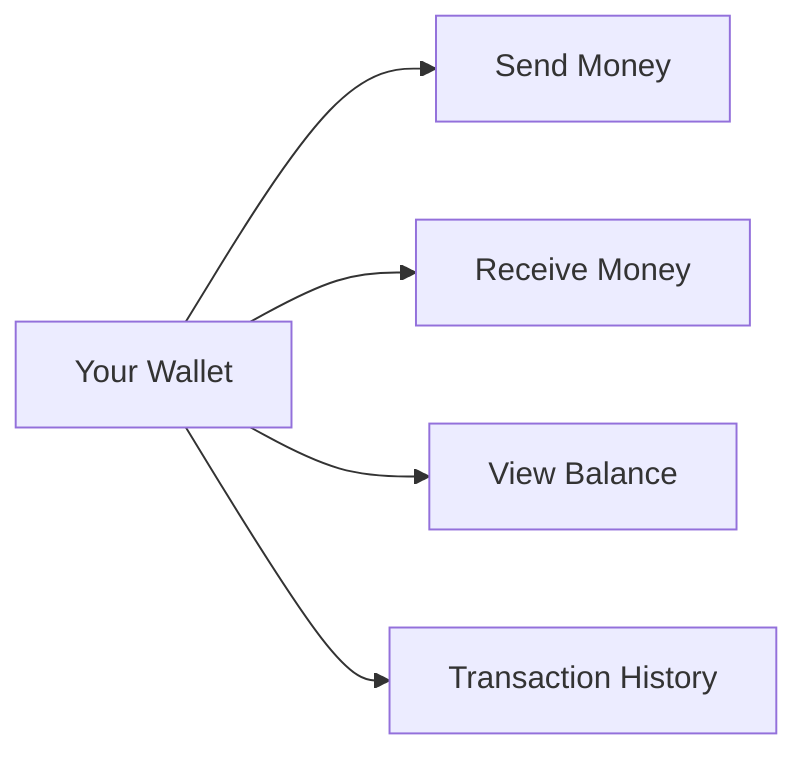
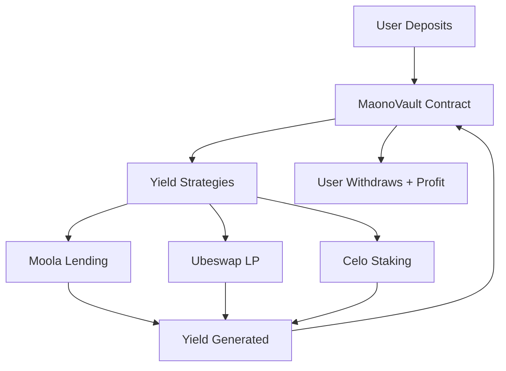
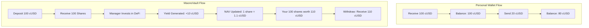
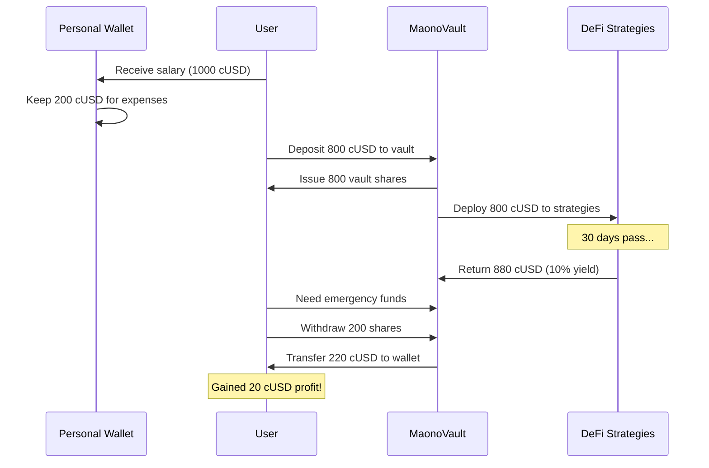
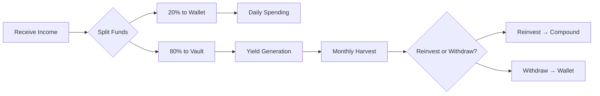

# Wallets vs Vaults - Understanding the Difference

## Overview

MtaaDAO offers two distinct financial systems: **Personal Wallets** for individual transactions and **Vaults** for managed, yield-generating investments. Understanding the difference is crucial for maximizing your financial strategy.

---

## Personal Wallets

### What is a Personal Wallet?

A personal wallet is your individual account for holding and transacting cryptocurrencies and stablecoins on the Celo blockchain.



### Features

| Feature | Description |
|---------|-------------|
| **Self-Custody** | You control your private keys |
| **Instant Transactions** | Send/receive in seconds |
| **Multi-Currency** | CELO, cUSD, cEUR, cREAL |
| **No Fees** | Internal transfers are free |
| **Phone Mapping** | Send to phone numbers |

### Use Cases

✅ **Daily Spending**: Pay for goods and services  
✅ **Quick Transfers**: Send money to friends/family  
✅ **Receiving Payments**: Get paid for work  
✅ **Bill Payments**: Pay utilities, rent, etc.

### How to Access

1. Navigate to `/wallet` in the app
2. View your balances across all currencies
3. Use Send/Receive features for transactions
4. Check transaction history

---

## Vaults System

### What is a Vault?

A vault is a smart contract-based system for **managed investments** that generate yield through DeFi strategies.



### Types of Vaults

#### 1. Personal Vaults (Individual)

**Purpose**: Personal savings with yield generation

**Features**:
- Individual ownership
- Professional management
- Automated yield strategies
- Performance tracking

**Example**:
```typescript
// Creating a personal vault
const personalVault = {
  type: "personal",
  userId: "user_123",
  initialDeposit: "1000 cUSD",
  strategy: "conservative", // 8-10% APY
  managementFee: "2%",
  performanceFee: "15%"
}
```

#### 2. Community Vaults (DAO Treasury)

**Purpose**: Shared DAO treasury with governance

**Features**:
- Multi-signature control
- Proposal-based withdrawals
- Community voting
- Transparent management

**Example**:
```typescript
// DAO community vault
const daoVault = {
  type: "community",
  daoId: "dao_456",
  totalMembers: 50,
  governance: "multi-sig",
  withdrawalApproval: "60% quorum required",
  strategy: "moderate" // 10-15% APY
}
```

#### 3. MaonoVault (Professional Managed)

**Purpose**: ERC4626 compliant vault with advanced strategies

**Features**:
- Share tokenization (ERC4626)
- NAV tracking
- Professional fund management
- Risk assessment
- Multi-asset support (planned)

**Smart Contract Architecture**:
```solidity
contract MaonoVault is ERC4626 {
  // Users deposit assets
  function deposit(uint256 assets, address receiver) 
    returns (uint256 shares);
  
  // Users receive shares representing ownership
  function balanceOf(address account) 
    returns (uint256 shares);
  
  // Manager updates NAV based on strategy performance
  function updateNAV(uint256 newNAV) 
    onlyManager;
  
  // Users redeem shares for assets + profit
  function redeem(uint256 shares, address receiver) 
    returns (uint256 assets);
}
```

---

## Key Differences Explained

### Ownership Model

**Wallet**:
```
You own → 100 cUSD directly
```

**Vault**:
```
You own → 100 vault shares
Shares represent → ~105 cUSD (after yield)
```

### Control & Access

| Aspect | Wallet | Vault |
|--------|--------|-------|
| **Immediate Access** | ✅ Instant | ⏳ Withdrawal delay (24-48h for large amounts) |
| **Full Control** | ✅ Complete | 🔒 Manager executes strategies |
| **Decision Making** | ✅ Solo | 🗳️ Governance (for DAO vaults) |

### Risk & Returns

**Wallet**:
- **Risk**: Low (you control everything)
- **Returns**: 0% (no yield, just storage)
- **Best For**: Active spending, immediate liquidity

**Vault**:
- **Risk**: Medium (DeFi strategies have risk)
- **Returns**: 8-15% APY (depending on strategy)
- **Best For**: Savings, long-term growth

---

## Visual Comparison



---

## When to Use Each

### Use Personal Wallet When:

✅ You need **immediate access** to funds  
✅ You're making **frequent transactions**  
✅ You want **zero risk** (no DeFi exposure)  
✅ You're paying for **goods/services**  
✅ You need to **send to phone numbers**

### Use Vault When:

✅ You have **savings goals** (long-term)  
✅ You want to **earn passive income**  
✅ You can **lock funds** for 30+ days  
✅ You're comfortable with **DeFi risks**  
✅ You want **professional management**

---

## Integration Flow

### Moving Between Wallet and Vault



---

## Fee Comparison

### Personal Wallet Fees

| Transaction Type | Fee |
|------------------|-----|
| **Internal Transfer** | Free (DAO to DAO) |
| **External Send** | Gas fee (~$0.001) |
| **Receive** | Free |
| **Currency Swap** | 0.3% (planned) |

### Vault Fees

| Fee Type | Amount | Frequency |
|----------|--------|-----------|
| **Management Fee** | 2% | Annual |
| **Performance Fee** | 15% | On profits only |
| **Deposit** | Free | N/A |
| **Withdrawal** | Free | N/A |

**Example Vault Fee Calculation**:
```
Deposit: 1000 cUSD
After 1 year: 1100 cUSD (10% yield)

Management Fee: 1000 × 2% = 20 cUSD
Performance Fee: 100 × 15% = 15 cUSD
Total Fees: 35 cUSD

Your Net Profit: 100 - 35 = 65 cUSD
Net Return: 6.5% APY (after fees)
```

---

## Security Considerations

### Wallet Security

🔒 **Private Key Management**: Your wallet, your responsibility  
🔒 **2FA Recommended**: Enable two-factor authentication  
🔒 **Seed Phrase Backup**: Store securely offline  
🔒 **Phishing Protection**: Verify all transactions

### Vault Security

🔒 **Smart Contract Audits**: Professionally audited code  
🔒 **Multi-sig Governance**: Community oversight  
🔒 **Risk Assessment**: Automated risk monitoring  
🔒 **Insurance** (planned): DeFi insurance coverage

---

## Best Practices

### Diversification Strategy

```
Total Assets: 10,000 cUSD

Recommended Allocation:
├── Personal Wallet (20%): 2,000 cUSD
│   └── For daily expenses, emergencies
│
├── Low-Risk Vault (50%): 5,000 cUSD
│   └── Conservative DeFi strategies
│
└── Growth Vault (30%): 3,000 cUSD
    └── Higher yield, higher risk strategies
```

### Monthly Workflow



---

## FAQ

**Q: Can I use my vault funds immediately?**  
A: Small withdrawals (<$1000) are instant. Large withdrawals have a 24-48h delay for security.

**Q: What if I need emergency access to vault funds?**  
A: Keep 10-20% of total funds in your personal wallet for emergencies.

**Q: Are vault yields guaranteed?**  
A: No. DeFi yields fluctuate based on market conditions. Historical APY: 8-15%.

**Q: Can I have multiple vaults?**  
A: Yes! You can create personal vaults with different risk profiles.

**Q: What happens if the vault loses money?**  
A: You share proportionally in losses. Risk management systems aim to minimize this.

---

## Next Steps

<div className="grid grid-cols-1 md:grid-cols-2 gap-4 mt-8">
  <a href="/features/maonovault" className="p-6 border rounded-lg hover:bg-gray-50">
    <h3 className="font-bold mb-2">📊 Learn About MaonoVault</h3>
    <p className="text-sm">Deep dive into professional vault management</p>
  </a>
  
  <a href="/features/defi-integration" className="p-6 border rounded-lg hover:bg-gray-50">
    <h3 className="font-bold mb-2">🌐 DeFi Strategies</h3>
    <p className="text-sm">Understand how yields are generated</p>
  </a>
</div>
