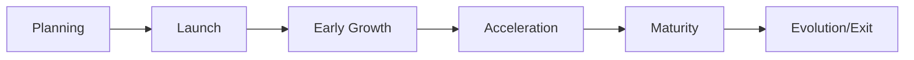

---
title: DAO Lifecycle & Management Guide
description: Complete guide to creating, managing, and scaling your DAO from inception to maturity
---

# DAO Lifecycle & Management Guide

## Table of Contents

1. [DAO Lifecycle Stages](#dao-lifecycle-stages)
2. [Pre-Launch Planning](#pre-launch-planning)
3. [Launch & Setup](#launch--setup)
4. [Growth Phase](#growth-phase)
5. [Maturity & Scaling](#maturity--scaling)
6. [Crisis Management](#crisis-management)
7. [Exit Strategies](#exit-strategies)
8. [Best Practices](#best-practices)

---

## DAO Lifecycle Stages

### Overview

Every DAO goes through distinct lifecycle stages, each with unique challenges and opportunities.



### Stage Characteristics

| Stage | Duration | Members | Treasury | Focus |
|-------|----------|---------|----------|-------|
| **Planning** | 2-4 weeks | 3-5 founders | $0-500 | Strategy |
| **Launch** | 1-2 weeks | 5-20 | $500-5K | Onboarding |
| **Early Growth** | 3-6 months | 20-100 | $5K-50K | Engagement |
| **Acceleration** | 6-12 months | 100-500 | $50K-500K | Scaling |
| **Maturity** | 1+ years | 500+ | $500K+ | Sustainability |

---

## Pre-Launch Planning

### Step 1: Define Your Mission

**Critical Questions:**

```markdown
1. What problem are we solving?
2. Who are we serving?
3. What makes us unique?
4. What's our long-term vision?
5. How do we measure success?
```

**Example Mission Statement:**

```
"The Youth Crypto Investment Club empowers young Kenyans (18-30) 
to learn about and invest in cryptocurrency together, building 
financial literacy and wealth through collective action."
```

### Step 2: Choose DAO Structure

**Decision Matrix:**

```typescript
const daoTypes = {
  shortTerm: {
    duration: "30-90 days",
    cost: "₭500 one-time",
    bestFor: "Events, campaigns, temporary projects",
    example: "Wedding fundraiser, hackathon team"
  },
  
  collective: {
    duration: "Ongoing",
    cost: "₭1,500/month",
    bestFor: "Chamas, clubs, long-term groups",
    example: "Investment club, community fund"
  },
  
  metaDAO: {
    duration: "Ongoing",
    cost: "Custom",
    bestFor: "Coordinating multiple DAOs",
    example: "Regional network, sector alliance"
  }
};
```

### Step 3: Governance Design

**Key Parameters:**

```typescript
const governanceConfig = {
  // Voting
  quorumPercentage: 30,      // 30% must vote
  approvalThreshold: 60,     // 60% must approve
  votingDuration: 7,         // 7 days to vote
  
  // Proposals
  proposalBond: 100,         // 100 MTAA to propose
  proposalCooldown: 3,       // 3 days between proposals
  
  // Roles
  roles: ['admin', 'elder', 'proposer', 'member'],
  
  // Treasury
  maxWithdrawal: 30,         // Max 30% of treasury per proposal
  multiSigThreshold: "3-of-5" // 3 signatures for large withdrawals
};
```

### Step 4: Financial Planning

**Initial Budget:**

```typescript
const budget = {
  setup: {
    daoCreation: "₭1,000",
    initialDeposit: "₭5,000",
    contingency: "₭1,000"
  },
  
  monthly: {
    subscription: "₭1,500",
    operations: "₭2,000",
    growth: "₭1,000"
  },
  
  sixMonthProjection: {
    revenue: "₭50,000",   // From member contributions
    expenses: "₭30,000",
    surplus: "₭20,000"
  }
};
```

---

## Launch & Setup

### Week 1: Technical Setup

**Day 1-2: DAO Creation**

```typescript
// Navigate to /create-dao

const daoConfig = {
  name: "Youth Crypto Investment Club",
  description: "Empowering young investors...",
  category: "investment",
  tier: "collective",
  
  governance: {
    quorum: 30,
    approval: 60,
    votingPeriod: 7
  },
  
  treasury: {
    initialDeposit: "5000",
    currency: "cUSD"
  }
};
```

**Day 3-4: Member Onboarding**

1. Create invitation links
2. Share on WhatsApp/Telegram
3. Conduct onboarding sessions
4. Set up member wallets

**Day 5-7: First Governance**

1. Create test proposal
2. Conduct first vote
3. Build confidence in system

### Week 2: Community Building

**Activities:**

- Daily check-ins in DAO chat
- Weekly educational sessions
- First community meeting
- Set up regular schedules

**Templates:**

```markdown
# Weekly Meeting Agenda

1. Welcome new members (10 min)
2. Treasury update (10 min)
3. Active proposals discussion (20 min)
4. Q&A (15 min)
5. Next steps (5 min)
```

---

## Growth Phase

### Month 1-3: Building Momentum

**Goals:**

- ✅ Reach 50 active members
- ✅ ₭25,000 treasury balance
- ✅ 5+ successful proposals
- ✅ 80%+ voting participation

**Weekly Metrics:**

```typescript
const weeklyMetrics = {
  members: {
    new: 8,
    active: 42,
    retention: "87%"
  },
  
  treasury: {
    deposits: "₭8,500",
    withdrawals: "₭2,000",
    balance: "₭18,300"
  },
  
  engagement: {
    proposals: 3,
    votes: 126,
    participation: "84%"
  }
};
```

### Month 4-6: Acceleration

**Strategies:**

1. **Referral Program**
   ```typescript
   const referralIncentives = {
     referrer: "200 MTAA per signup",
     referee: "100 MTAA welcome bonus",
     bonuses: "500 MTAA at 5 referrals"
   };
   ```

2. **Content Marketing**
   - Weekly blog posts
   - Social media presence
   - Success stories
   - Educational content

3. **Partnership Development**
   - Collaborate with other DAOs
   - Join MetaDAO networks
   - Partner with local businesses

### Scaling Challenges

**Common Issues:**

| Challenge | Solution |
|-----------|----------|
| Low participation | Rewards program, simpler proposals |
| Treasury depletion | Diversify income, reduce expenses |
| Governance gridlock | Delegation, lower quorum temporarily |
| Member conflicts | Clear dispute resolution process |

---

## Maturity & Scaling

### Institutional Features

**Advanced Governance:**

```typescript
const advancedGovernance = {
  // Quadratic voting
  votingModel: "quadratic",
  
  // Specialized roles
  roles: {
    treasurer: { permissions: ["view_treasury", "create_financial_reports"] },
    moderator: { permissions: ["manage_members", "enforce_rules"] },
    strategist: { permissions: ["create_proposals", "analyze_data"] }
  },
  
  // Sub-committees
  committees: [
    { name: "Investment Committee", members: 5, focus: "Asset allocation" },
    { name: "Growth Committee", members: 5, focus: "Member acquisition" },
    { name: "Tech Committee", members: 3, focus: "Platform improvements" }
  ]
};
```

### Revenue Diversification

```typescript
const revenueStreams = {
  memberContributions: "60%",   // Primary income
  investmentReturns: "25%",     // From DeFi yields
  services: "10%",              // Consulting, training
  grants: "5%"                  // External funding
};
```

### MetaDAO Participation

**Benefits:**

- Bulk purchasing power
- Shared infrastructure
- Cross-DAO collaboration
- Regional influence

**Requirements:**

- 100+ active members
- ₭50,000+ treasury
- 6+ months operational
- Good governance record

---

## Crisis Management

### Financial Crisis

**Warning Signs:**

- Burn rate >20% of treasury/month
- <3 months runway
- Declining contributions
- Large unexpected expenses

**Response Plan:**

```typescript
const financialCrisis = {
  immediate: [
    "Pause all non-essential spending",
    "Emergency member contribution drive",
    "Activate reserve funds"
  ],
  
  shortTerm: [
    "Reduce operational costs 30%",
    "Negotiate payment deferrals",
    "Launch fundraising campaign"
  ],
  
  longTerm: [
    "Diversify revenue streams",
    "Build 6-month reserve fund",
    "Implement stricter budget controls"
  ]
};
```

### Governance Crisis

**Scenarios:**

1. **Malicious Proposal**
   ```typescript
   // Emergency veto process
   if (proposal.isHighRisk && council.agrees) {
     await emergencyVeto(proposal.id);
     await lockProposer(proposer.id, "7 days");
   }
   ```

2. **Vote Manipulation**
   ```typescript
   // Implement vote weight caps
   const maxVotingPower = totalSupply * 0.10; // 10% max
   ```

3. **Member Exodus**
   - Survey departing members
   - Address concerns publicly
   - Implement requested changes
   - Rebuild trust gradually

---

## Exit Strategies

### Graceful Shutdown

**Process:**

1. **Announce Intent** (30 days notice)
2. **Final Vote** (75% approval required)
3. **Asset Distribution**
   - Pay all debts
   - Distribute treasury proportionally
   - Transfer IP/assets
4. **Archive DAO**
   - Preserve transaction history
   - Maintain read-only access
   - Document learnings

### Merger

**Steps:**

```typescript
const mergerProcess = {
  phase1: "Identify merger partner",
  phase2: "Negotiate terms",
  phase3: "Member vote (both DAOs, 75% approval)",
  phase4: "Combine treasuries",
  phase5: "Integrate governance",
  phase6: "Unified operations"
};
```

### Evolution

**Transformation Options:**

- Short-term → Collective DAO
- Collective → MetaDAO
- Regional → National DAO
- Informal → Registered Entity

---

## Best Practices

### Communication

**Channels:**

```typescript
const communicationChannels = {
  urgent: "Telegram group",
  official: "DAO dashboard",
  casual: "Discord server",
  public: "Twitter/LinkedIn",
  detailed: "Monthly newsletter"
};
```

### Documentation

**Essential Documents:**

1. **DAO Charter** - Mission, vision, values
2. **Governance Rules** - Voting, proposals, roles
3. **Financial Policy** - Budget, spending limits
4. **Operational Manual** - Processes, procedures
5. **Member Handbook** - Onboarding, expectations

### Regular Rhythms

**Weekly:**
- Member check-ins
- Proposal reviews
- Chat moderation

**Monthly:**
- Financial reports
- Community meetings
- Strategy sessions

**Quarterly:**
- Performance reviews
- Goal setting
- Member surveys

---

## Success Metrics

### Key Performance Indicators

```typescript
const kpis = {
  membership: {
    growth: "+15% MoM",
    retention: ">85%",
    engagement: ">70% active"
  },
  
  financial: {
    treasuryGrowth: "+20% MoM",
    burnRate: "<10% of treasury",
    runway: ">6 months"
  },
  
  governance: {
    participation: ">60%",
    proposalSuccess: ">70%",
    quorumAchievement: ">90%"
  },
  
  impact: {
    memberSatisfaction: ">4.5/5",
    communityBenefit: "Measurable",
    sustainability: "Self-sufficient"
  }
};
```

---

## Resources

### Templates

- [DAO Charter Template](/templates/dao-charter)
- [Proposal Template](/templates/proposal)
- [Financial Report Template](/templates/financial-report)
- [Meeting Agenda Template](/templates/meeting-agenda)

### Tools

- Morio AI Assistant (built-in)
- Treasury Dashboard (built-in)
- Analytics Platform (built-in)
- Voting System (built-in)

### Support

- **Documentation**: [docs.mtaadao.com](https://docs.mtaadao.com)
- **Community**: [Discord](https://discord.gg/mtaadao)
- **Email**: support@mtaadao.com
- **Office Hours**: Tuesdays 2-4 PM EAT

---

**Last Updated**: January 2025  
**Version**: 1.0  
**Status**: Production Ready
