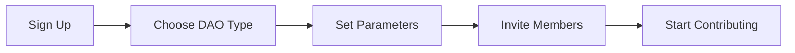

# Getting Started with MtaaDAO

## Welcome! (Karibu!)

You're about to join thousands of Africans who are taking control of their community finance. This guide will walk you through creating your first DAO in less than 10 minutes.

### What You'll Need

Before we start, make sure you have:

- 📱 A smartphone with internet connection
- 💳 M-Pesa, MTN Money, or Airtel Money account (or a crypto wallet)
- 👥 At least 3 people ready to join your DAO
- 🎯 A clear purpose for your DAO (funeral fund, chama, project, etc.)

### Quick Start in 5 Steps



#### Step 1: Create Your Account

Visit **[app.mtaadao.com](https://app.mtaadao.com)** and click **"Get Started"**.

You can sign up using:
- 📧 Email address
- 📱 Phone number (get OTP via SMS)
- 🔐 Google account
- 💬 Telegram account

**No blockchain knowledge required!** Our platform handles all the technical stuff behind the scenes.

#### Step 2: Choose Your DAO Type

Pick the right type for your community:

| DAO Type | Best For | Cost | Duration |
|----------|----------|------|----------|
| **Free Tier** | Testing, small groups (5-10 people) | Free | Forever |
| **Short-Term** | Events, fundraisers, specific projects | ₭500 one-time | 30-90 days |
| **Collective** | Ongoing groups, chamas, cooperatives | ₭1,500/month | Recurring |
| **MetaDAO** | Networks of DAOs, regional alliances | Custom | Flexible |

[Learn more about DAO types →](/dao-types)

#### Step 3: Configure Your DAO

Fill in the basic details:

```typescript
// Example DAO Configuration
{
  name: "Eastlands Funeral Fund",
  description: "Supporting our community in times of loss",
  type: "collective",
  contributionAmount: "500 KES",  // Per member per month
  contributionFrequency: "monthly",
  quorumPercentage: 20,  // % of members needed for decisions
  votingPeriod: 72,  // Hours members have to vote
  executionDelay: 24  // Hours before approved proposals execute
}
```

**Morio AI Tip:** Our AI assistant **Morio** will suggest optimal settings based on your group size and purpose. Just chat with Morio if you're unsure!

#### Step 4: Invite Your Community

Share your unique invite code or link:

```
🔗 Join Eastlands Funeral Fund
https://app.mtaadao.com/join/EASTL-2024-FU01

Or use code: EASTL-2024-FU01
```

Members can join by:
1. Clicking the link
2. Creating their account (30 seconds)
3. Accepting the DAO terms
4. Making their first contribution

**Privacy Note:** You control who can join. Set your DAO to:
- 🌍 **Public** - Anyone with the link can join
- 🔒 **Private** - You must approve each member
- 🎟️ **Invite-Only** - Only people with the code can request to join

#### Step 5: Make Your First Contribution

Once you have 3+ members, activate your treasury:

1. Click **"Contribute to Treasury"**
2. Choose payment method:
   - **M-Pesa:** Send to paybill 522522
   - **Bank Transfer:** Via Pesalink or EFT
   - **Crypto:** Connect wallet and send CELO/cUSD
3. Confirm transaction
4. Funds are locked in multi-sig smart contract

🎉 **Congratulations!** Your DAO is now active and ready to start making decisions together.

---

## What's Next?

<Cards>
  <Card 
    title="📝 Create Your First Proposal" 
    href="/governance/proposals"
  >
    Learn how to propose spending, policy changes, or member decisions.
  </Card>
  
  <Card 
    title="🗳️ Vote on Decisions" 
    href="/governance/voting"
  >
    Understand how democratic voting works in MtaaDAO.
  </Card>
  
  <Card 
    title="💰 Manage Treasury" 
    href="/financial/wallets"
  >
    Track funds, view transactions, and monitor DAO health.
  </Card>
  
  <Card 
    title="🤖 Talk to Morio" 
    href="/morio-ai"
  >
    Get AI-powered help with proposals, budgets, and decisions.
  </Card>
</Cards>

---

## Video Tutorial

<div className="aspect-video">
  <iframe 
    width="100%" 
    height="100%" 
    src="https://www.youtube.com/embed/..." 
    title="How to Create a MtaaDAO in 5 Minutes"
    frameBorder="0" 
    allow="accelerometer; autoplay; clipboard-write; encrypted-media; gyroscope; picture-in-picture" 
    allowFullScreen
  />
</div>

---

## Common Questions for New Users

### How much does it cost?

- **Free Tier:** $0 (perfect for testing)
- **Short-Term DAOs:** ₭500 one-time payment
- **Collective DAOs:** ₭1,500/month
- Platform takes 2.5% of transactions for infrastructure

[See detailed pricing →](/pricing)

### Is my money safe?

Yes! Funds are locked in **multi-signature smart contracts** on the blockchain. This means:
- ❌ No single person can access funds alone
- ✅ Requires 3+ elder/admin signatures for withdrawals
- ✅ Every transaction is publicly recorded
- ✅ Automatic execution prevents human error

[Learn about security →](/faq/security)

### What if members don't pay?

You set contribution rules when creating your DAO:
- Late payment grace periods
- Automatic membership suspension after X missed payments
- Reinstatement conditions

Everything is enforced automatically by smart contracts.

### Can I change DAO settings later?

Yes! Changes require a **governance proposal** that all members vote on:
1. Someone proposes the change
2. Members discuss and vote
3. If approved, changes take effect automatically

This ensures transparency and prevents unilateral decisions.

---

## Need Help?

- 💬 **Chat with Morio:** Click the AI assistant button (bottom right)
- 📱 **Telegram Community:** Join thousands of DAO creators
- 📧 **Email Support:** support@mtaadao.com
- 📚 **Knowledge Base:** Search our FAQ

**Tutaonana!** (See you!) Welcome to the MtaaDAO family.
