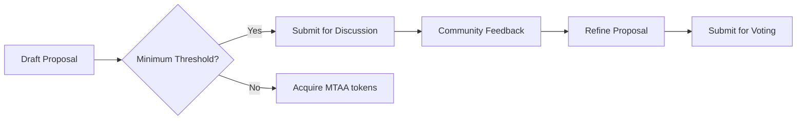

---
title: Complete Governance Guide
description: Master DAO governance, proposals, voting, and decision-making in MtaaDAO
---

# Complete Governance Guide

Everything you need to know about participating in and managing DAO governance.

---

## Overview

MtaaDAO governance enables decentralized decision-making through:
- **Proposals**: Suggest changes and actions
- **Voting**: Community-driven decisions
- **Execution**: Automatic implementation of approved proposals
- **Delegation**: Assign voting power to trusted members

---

## Proposal Types

### 1. Financial Proposals

**Treasury Withdrawal**
```typescript
{
  type: "treasury_withdrawal",
  amount: "5000 cUSD",
  recipient: "0xRecipientAddress",
  purpose: "Developer payment for Q1 2025",
  
  votingPeriod: 168, // 7 days
  quorumRequired: 60, // percentage
  approvalThreshold: 70 // percentage
}
```

**Budget Allocation**
```typescript
{
  type: "budget_allocation",
  budget: {
    development: "30000 cUSD",
    marketing: "15000 cUSD",
    operations: "10000 cUSD",
    community: "5000 cUSD"
  },
  duration: "Q2 2025",
  votingPeriod: 336 // 14 days for major decisions
}
```

---

### 2. Governance Proposals

**Change Voting Rules**
```typescript
{
  type: "governance_change",
  changes: {
    quorumPercentage: 60, // from 50%
    votingPeriod: 168, // from 72 hours
    proposalThreshold: 1000 // MTAA tokens required
  },
  rationale: "Increase engagement and thoughtful voting"
}
```

**Modify Membership Requirements**
```typescript
{
  type: "membership_rules",
  newRules: {
    minimumStake: "500 MTAA",
    probationPeriod: 30, // days
    reputationThreshold: 100,
    referralRequired: true
  }
}
```

---

### 3. Technical Proposals

**Smart Contract Upgrade**
```typescript
{
  type: "contract_upgrade",
  contract: "MtaaGovernance",
  newVersion: "v2.1.0",
  changes: [
    "Add quadratic voting",
    "Enable conviction voting",
    "Implement vote delegation"
  ],
  auditReport: "https://audit.link",
  votingPeriod: 336 // 14 days for critical changes
}
```

**Integration Addition**
```typescript
{
  type: "integration",
  service: "Chainlink Price Feeds",
  purpose: "Real-time oracle data for treasury",
  cost: "100 LINK/month",
  securityReview: "Passed Certora audit"
}
```

---

### 4. Community Proposals

**Event Funding**
```typescript
{
  type: "community_event",
  eventName: "MtaaDAO Nairobi Meetup",
  budget: "2000 cUSD",
  breakdown: {
    venue: "800 cUSD",
    catering: "700 cUSD",
    swag: "300 cUSD",
    speakers: "200 cUSD"
  },
  expectedAttendees: 100,
  date: "2025-02-15"
}
```

**Partnership Proposal**
```typescript
{
  type: "partnership",
  partner: "Celo Foundation",
  terms: {
    grant: "50000 cUSD",
    support: "Technical advisory",
    duration: "12 months"
  },
  benefits: "Ecosystem growth, credibility, funding"
}
```

---

## Voting Mechanisms

### 1. Token-Weighted Voting

**How it Works**:
```typescript
votingPower = sqrt(tokensHeld)

// Example
Alice holds 10,000 MTAA = 100 votes
Bob holds 1,000 MTAA = 31.6 votes
Carol holds 100 MTAA = 10 votes
```

**Advantages**:
- Rewards long-term holders
- Prevents plutocracy (quadratic dampening)
- Encourages token accumulation

**Best For**:
- Financial decisions
- Major governance changes
- Strategic partnerships

---

### 2. One Member One Vote

**How it Works**:
```typescript
votingPower = 1 (regardless of tokens)

// Example
Alice = 1 vote
Bob = 1 vote
Carol = 1 vote
```

**Advantages**:
- True democracy
- Prevents whale dominance
- Encourages active participation

**Best For**:
- Community events
- Social proposals
- Member recognition

---

### 3. Reputation-Weighted Voting

**How it Works**:
```typescript
votingPower = baseVote + (reputation / 100)

// Example
Alice (500 rep) = 1 + 5 = 6 votes
Bob (200 rep) = 1 + 2 = 3 votes
Carol (50 rep) = 1 + 0.5 = 1.5 votes
```

**Advantages**:
- Rewards contribution
- Merit-based influence
- Quality over quantity

**Best For**:
- Technical decisions
- Quality standards
- Task assignments

---

### 4. Conviction Voting (Advanced)

**How it Works**:
```typescript
votingPower = tokensStaked × timeStaked

// Example
Alice stakes 1000 MTAA for 30 days = 30,000 conviction
Bob stakes 500 MTAA for 60 days = 30,000 conviction
Carol stakes 2000 MTAA for 10 days = 20,000 conviction
```

**Advantages**:
- Rewards long-term commitment
- Reduces vote buying
- Continuous voting

**Best For**:
- Grant funding
- Treasury management
- Long-term strategy

---

## Proposal Lifecycle

### Phase 1: Proposal Creation



**Requirements**:
- Hold minimum 1,000 MTAA tokens
- Reputation score ≥ 50
- No active proposals from same author
- Clear title, description, and rationale

**Example**:
```typescript
POST /api/proposals/create
{
  "title": "Hire Full-Stack Developer",
  "description": "Fund a 6-month contract for platform development",
  "type": "treasury_withdrawal",
  "amount": "12000 cUSD",
  "recipient": "0xDeveloperAddress",
  "votingPeriod": 168,
  "quorum": 60
}
```

---

### Phase 2: Discussion Period (48 hours)

**What Happens**:
- Proposal visible to all members
- Comments and questions
- Author can refine details
- Community gauges sentiment

**Engagement Tools**:
- 💬 Comments
- 👍 👎 Reactions
- 🔔 Notifications
- 📊 Sentiment polling

**Example Discussion**:
```
Alice: "What specific features will the developer build?"
Author: "Primary focus: Multi-chain bridge, NFT marketplace integration"

Bob: "6 months seems short. What if we need more time?"
Author: "Contract renewable based on performance review"

Carol: "Can we see the developer's portfolio?"
Author: [Links to GitHub and previous projects]
```

---

### Phase 3: Voting Period (7 days default)

**Voting Interface**:
```typescript
interface VotingOptions {
  vote: "yes" | "no" | "abstain";
  votingPower: number;
  delegated: boolean;
  reason?: string; // optional comment
}
```

**Real-Time Progress**:
```
Developer Hiring Proposal
━━━━━━━━━━━━━━━━━━━━━━━━━━━━━━━━
Yes:     ████████████████░░░░ 78% (234 votes)
No:      ███░░░░░░░░░░░░░░░░░ 15% (45 votes)
Abstain: █░░░░░░░░░░░░░░░░░░░  7% (21 votes)

Current Quorum: 65% ✅ (300/460 members)
Approval: 78% ✅ (Threshold: 70%)

Status: PASSING
Time Remaining: 3 days 14 hours
```

---

### Phase 4: Execution (Automatic)

**Smart Contract Execution**:
```solidity
function executeProposal(uint256 proposalId) external {
    Proposal storage proposal = proposals[proposalId];
    
    require(block.timestamp > proposal.endTime, "Voting not ended");
    require(!proposal.executed, "Already executed");
    require(isApproved(proposalId), "Not approved");
    
    if (proposal.proposalType == ProposalType.TreasuryWithdrawal) {
        treasury.transfer(proposal.recipient, proposal.amount);
    }
    
    proposal.executed = true;
    emit ProposalExecuted(proposalId);
}
```

**Post-Execution**:
- Transaction hash published
- All voters notified
- Proposal archived
- Impact tracked

---

## Delegation System

### How Delegation Works

**Delegate Your Votes**:
```typescript
POST /api/governance/delegate
{
  "delegate": "0xTrustedMemberAddress",
  "scope": "all" | "financial" | "technical",
  "duration": 90 // days
}
```

**Delegation Scenarios**:

**Scenario 1: Full Delegation**
```
Alice holds 10,000 MTAA
Delegates all voting power to Bob
Bob now has his votes + Alice's votes
Alice can revoke anytime
```

**Scenario 2: Partial Delegation**
```
Alice holds 10,000 MTAA
Delegates only "financial" proposals to Bob
Delegates only "technical" proposals to Carol
Alice votes directly on community proposals
```

**Scenario 3: Temporary Delegation**
```
Alice going on vacation for 30 days
Delegates to Bob for 30 days
Auto-reverts after duration
```

---

## Quorum & Approval Thresholds

### Understanding Quorum

**Quorum** = Minimum participation required

```typescript
interface QuorumRules {
  percentage: 60; // 60% of members must vote
  minimumVoters: 100; // At least 100 members
  calculation: "totalMembers" | "activeMembers";
}
```

**Example**:
```
DAO Members: 500
Quorum: 60%
Required Voters: 300

Current Votes: 285
Status: ❌ Not reached (need 15 more votes)

Current Votes: 310
Status: ✅ Quorum reached!
```

---

### Approval Thresholds

**Different thresholds for different proposals**:

| Proposal Type | Approval Required | Example |
|---------------|-------------------|---------|
| **Minor** | 50%+1 of votes | Community events |
| **Standard** | 60% approval | Budget allocations |
| **Major** | 70% approval | Governance changes |
| **Critical** | 80% approval | Smart contract upgrades |

**Example Calculation**:
```
Total Votes: 300
Approval Threshold: 70%

Yes: 220 votes (73%) ✅ PASSES
No: 80 votes (27%)

Yes: 200 votes (67%) ❌ FAILS (need 210 votes)
```

---

## Advanced Features

### Emergency Proposals

**Fast-Track Critical Issues**:
```typescript
{
  type: "emergency",
  reason: "Security vulnerability detected",
  action: "Pause smart contract",
  votingPeriod: 24, // 24 hours instead of 7 days
  approvalThreshold: 80, // Higher threshold for safety
  emergencyMultisig: true // Requires multi-sig approval
}
```

**Emergency Triggers**:
- Security breach
- Smart contract vulnerability
- Market crash requiring immediate action
- Legal compliance requirement

---

### Proposal Templates

**Pre-Built Templates**:

```typescript
// 1. Contributor Payment
{
  template: "contributor_payment",
  fields: {
    contributor: "address",
    amount: "number",
    workDescription: "text",
    proofOfWork: "url"
  }
}

// 2. Partnership Request
{
  template: "partnership",
  fields: {
    partnerName: "text",
    benefits: "textarea",
    terms: "textarea",
    duration: "number"
  }
}

// 3. Event Funding
{
  template: "event",
  fields: {
    eventName: "text",
    date: "date",
    budget: "breakdown",
    expectedImpact: "textarea"
  }
}
```

---

## Gamification & Incentives

### Participation Rewards

**Earn MTAA for Governance**:

```typescript
const governanceRewards = {
  createProposal: 100,
  voteOnProposal: 50,
  discussionComment: 25,
  proposalPassed: 200, // bonus
  highQualityProposal: 500, // community-rated
  
  streakBonus: {
    "7 consecutive votes": "1.5x",
    "30 consecutive votes": "2x",
    "90 consecutive votes": "3x"
  }
};
```

**Leaderboard**:
```
Top Governance Contributors (This Month)

1. Alice       850 MTAA  | 12 proposals, 45 votes
2. Bob         720 MTAA  | 8 proposals, 52 votes
3. Carol       680 MTAA  | 15 proposals, 38 votes
```

---

## Best Practices

### For Proposal Authors

1. **Be Clear**: Specific, actionable proposals
2. **Provide Context**: Why is this needed?
3. **Show Impact**: What changes with approval?
4. **Budget Details**: Exact amounts and breakdown
5. **Engage Community**: Respond to questions

**Good Proposal Example**:
```
Title: Hire UX Designer for Mobile App Redesign

Description:
Our mobile app has 65% bounce rate. A UX designer can:
- Redesign onboarding flow
- Improve navigation
- Conduct user testing

Budget: 8,000 cUSD (6-month contract)
Expected Impact: Reduce bounce to 30%, increase DAU by 40%
Portfolio: [designer's work]

Timeline:
Month 1-2: Research & wireframes
Month 3-4: Design & testing
Month 5-6: Implementation support
```

---

### For Voters

1. **Read Thoroughly**: Understand before voting
2. **Ask Questions**: Seek clarification
3. **Consider Long-Term**: Think beyond immediate impact
4. **Delegate Wisely**: Choose trusted, knowledgeable delegates
5. **Stay Engaged**: Vote consistently

---

## Troubleshooting

### Common Issues

**1. Proposal Not Passing Quorum**

**Solutions**:
- Extend voting period (+3 days)
- Increase community outreach
- Simplify proposal language
- Offer incentives for voting

**2. Controversial Proposal (50/50 split)**

**Solutions**:
- Extend discussion period
- Break into smaller proposals
- Seek compromise amendments
- Table for future revision

**3. Low Voter Turnout**

**Solutions**:
- Notification campaigns
- Voting reminders (24h, 1h before close)
- Gamification (streak bonuses)
- Community calls to discuss

---

## API Reference

### Create Proposal
```typescript
POST /api/proposals/create
{
  "title": "Proposal title",
  "description": "Full description",
  "type": "treasury_withdrawal",
  "amount": "5000",
  "votingPeriod": 168
}
```

### Vote on Proposal
```typescript
POST /api/proposals/vote
{
  "proposalId": "prop_123",
  "vote": "yes"
}
```

### Delegate Votes
```typescript
POST /api/governance/delegate
{
  "delegate": "0xAddress",
  "scope": "all"
}
```

---

## Support

Questions about governance?

- **Discord**: #governance channel
- **Docs**: [docs.mtaadao.com/governance](https://docs.mtaadao.com)
- **Email**: governance@mtaadao.com
