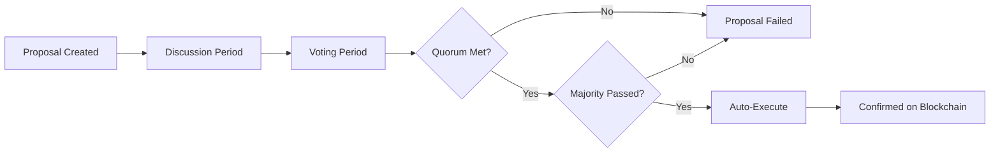

# Governance Overview

## Democracy on the Blockchain

Every DAO is a democracy. MtaaDAO provides the infrastructure for transparent, fair, and efficient governance where every voice matters and every vote counts.

---

## How Governance Works

### The Decision-Making Cycle



1. **Anyone can propose** - Members suggest how to use funds or change rules
2. **Community discusses** - Transparent debate before voting begins
3. **Democratic voting** - Every eligible member casts their vote
4. **Automatic execution** - If passed, smart contracts execute immediately
5. **Permanent record** - Everything recorded on blockchain forever

---

## Proposal Types

### Financial Proposals

**Grant Requests**
```typescript
{
  type: "grant_request",
  title: "Fund Borehole Construction",
  budget: "500000",  // ₭500,000
  recipient: "0x742d35Cc...",
  deliverables: ["Complete borehole", "Water quality test", "Maintenance training"],
  timeline: "90 days"
}
```

**Treasury Allocation**
```typescript
{
  type: "treasury_allocation",
  title: "Invest 30% in Money Market Fund",
  amount: "300000",
  strategy: "low_risk_savings",
  expectedReturn: "8% annually",
  lockPeriod: "6 months"
}
```

### Membership Proposals

**Add Member**
```typescript
{
  type: "add_member",
  title: "Welcome Jane Kamau",
  candidate: "+254712345678",
  sponsor: "John Mwangi",
  tier: "full_member",
  contributionRequired: "500 KES/month"
}
```

**Remove Member**
```typescript
{
  type: "remove_member",
  title: "Remove for Non-Payment",
  member: "user_abc123",
  reason: "6 months unpaid contributions",
  evidence: ["Payment records", "Warning history"],
  refund: "Pro-rata treasury share"
}
```

### Governance Proposals

**Change Rules**
```typescript
{
  type: "policy_change",
  title: "Increase Quorum to 30%",
  currentValue: 20,
  proposedValue: 30,
  rationale: "More participation = better decisions",
  effectiveDate: "2024-12-01"
}
```

**Upgrade DAO**
```typescript
{
  type: "dao_upgrade",
  title: "Upgrade to Collective Tier",
  currentTier: "short_term",
  newTier: "collective",
  monthlyCost: "1500 KES",
  costPerMember: "30 KES" // (1500 ÷ 50 members)
}
```

---

## Voting Mechanisms

### Vote Weight Models

**1. One Person = One Vote (Default)**
```
Every member has equal power:
- Grace with 1 month membership: 1 vote
- Peter with 3 years membership: 1 vote

Use when: Community values equality
```

**2. Contribution-Weighted**
```
Vote power proportional to contributions:
- Contributed ₭50,000: 50 votes
- Contributed ₭10,000: 10 votes

Use when: "Stake in the game" matters
```

**3. Quadratic Voting**
```
√(Contribution) = Vote Power
- Contributed ₭10,000: √10,000 = 100 votes
- Contributed ₭40,000: √40,000 = 200 votes

Use when: Balance between equality and stake
```

**4. Membership Duration**
```
Vote power increases with tenure:
- < 6 months: 1x weight
- 6-12 months: 1.5x weight
- 1-2 years: 2x weight
- 2+ years: 3x weight

Use when: Rewarding commitment
```

**5. Hybrid Models**
```
Combine multiple factors:
VotePower = (ContributionWeight × 0.5) + (DurationWeight × 0.3) + (BaseVote × 0.2)

Use when: Complex communities need nuance
```

[Learn more about voting →](/governance/voting)

---

## Quorum Requirements

**What is quorum?**  
Minimum % of members who must vote for a decision to be valid.

### Typical Quorum Levels

| Proposal Type | Recommended Quorum | Rationale |
|---------------|-------------------|-----------|
| **Routine Payouts** | 10-20% | Fast decisions for regular operations |
| **Financial Grants** | 20-30% | Significant treasury impact |
| **Member Decisions** | 30-40% | Community-wide impact |
| **Rule Changes** | 40-60% | Fundamental DAO structure |
| **Constitutional Changes** | 60-80% | Core values and principles |

### Dynamic Quorum

MtaaDAO can adjust quorum based on context:

```typescript
// AI-powered dynamic quorum
function calculateQuorum(proposal) {
  let baseQuorum = 20;  // Start at 20%
  
  // Increase for high-value proposals
  if (proposal.budget > treasuryBalance * 0.2) {
    baseQuorum += 10;  // +10% for >20% of treasury
  }
  
  // Increase for risky proposals
  if (proposal.riskLevel === 'high') {
    baseQuorum += 15;
  }
  
  // Decrease for time-sensitive
  if (proposal.urgent === true) {
    baseQuorum -= 5;
  }
  
  // Decrease if high engagement
  const avgParticipation = getHistoricalParticipation();
  if (avgParticipation > 60) {
    baseQuorum -= 5;  // Active community = lower quorum OK
  }
  
  return Math.max(10, Math.min(80, baseQuorum));  // Clamp 10-80%
}
```

[Learn about quorum →](/governance/quorum)

---

## Vote Delegation

**Don't have time to vote on everything?** Delegate your voting power to trusted members.

### How It Works

```
1. You delegate to Expert:
   "I trust Sarah to vote on financial proposals"

2. When financial proposal appears:
   - Sarah votes Yes (using her vote + your delegated vote)
   - Your vote automatically follows hers

3. You can override anytime:
   - Vote directly on specific proposal
   - Your vote overrides delegation for that proposal
```

### Delegation Strategies

**By Expertise:**
```
- Financial proposals → Delegate to treasurer
- Technical proposals → Delegate to tech lead
- Agricultural proposals → Delegate to farmer rep
```

**By Convenience:**
```
- "I'm traveling for 3 months"
- Delegate all votes to trusted elder
- Revoke when back
```

**By Category:**
```
- Routine payouts → Auto-approve (via smart contract)
- Major decisions → Vote personally
- Medium decisions → Delegate to council
```

[Learn about delegation →](/governance/delegation)

---

## Trust & Reputation System

Members build reputation through participation and good behavior:

### Reputation Score Factors

```typescript
reputationScore = {
  votingParticipation: 0.25,    // 25% weight
  proposalQuality: 0.20,        // 20% weight
  financialResponsibility: 0.20, // 20% weight
  communityEngagement: 0.15,    // 15% weight
  tenureBonus: 0.10,            // 10% weight
  peerEndorsements: 0.10        // 10% weight
}
```

**Voting Participation:**
- Voted on 90%+ proposals: +50 points
- Voted on 50-89%: +25 points
- Voted on <50%: 0 points
- Never votes: -25 points

**Proposal Quality:**
- Proposals passed and executed well: +30 points
- Proposals passed but execution issues: +10 points
- Proposals failed: 0 points (no penalty for trying)
- Spam proposals: -50 points

**Financial Responsibility:**
- 100% contribution compliance: +40 points
- 1-2 late payments: +20 points
- 3+ late payments: 0 points
- Defaults on obligations: -100 points

**Community Engagement:**
- Active in discussions: +20 points
- Helps other members: +15 points
- Mentors new members: +25 points
- Reports issues responsibly: +10 points

**Tenure Bonus:**
- < 6 months: 0 points
- 6-12 months: +10 points
- 1-2 years: +25 points
- 2+ years: +50 points

**Peer Endorsements:**
- Each endorsement from trusted member: +5 points (max 100)

### Reputation Benefits

| Score Range | Trust Level | Benefits |
|-------------|-------------|----------|
| 300+ | **Elder** | Can create proposals instantly, higher vote weight option, can become multi-sig signer |
| 200-299 | **Trusted** | Fast-track proposal approval, can delegate to others, eligible for leadership roles |
| 100-199 | **Member** | Standard rights, can vote and propose |
| 50-99 | **New** | Can vote only, proposals require sponsor |
| < 50 | **Probation** | Limited rights, mentor required |
| < 0 | **Suspended** | No rights until restored |

[Learn more about trust & reputation →](/governance/trust-reputation)

---

## Dispute Resolution

When members disagree:

### Internal Resolution (Preferred)

```
Step 1: Discussion
- Affected parties present arguments
- Community moderates
- AI analyzes facts

Step 2: Mediation
- Neutral elder facilitates
- Find compromise
- Document agreement

Step 3: Community Vote
- If mediation fails
- Full member vote
- 60% supermajority to decide

Step 4: Appeal (Once)
- Can appeal within 7 days
- New vote with fresh evidence
- Final decision
```

### External Arbitration (Rare)

For serious disputes:
- Independent arbitrator appointed
- Both parties present evidence
- Arbitrator decision is binding
- Enforced via smart contract

**Cost:** Split between parties (₭5,000-₭50,000 depending on complexity)

---

## Best Practices

### For Proposal Creators

✅ **Be specific:**
```
❌ "Let's help John"
✅ "Grant ₭50,000 to John Kamau for medical bills (hospital invoice attached)"
```

✅ **Provide evidence:**
```
- Attach documents
- Link to previous discussions
- Show cost breakdowns
- Reference similar successful proposals
```

✅ **Explain rationale:**
```
Not just WHAT you want, but WHY
- What problem does this solve?
- What happens if we don't do this?
- What are the risks?
```

✅ **Set clear metrics:**
```
"Success = 500 families with clean water within 90 days"
Not: "Success = make things better"
```

### For Voters

✅ **Read the full proposal:**
- Don't just read the title
- Check attachments and evidence
- Review discussion comments

✅ **Ask questions:**
- If unclear, ask before voting
- Challenge assumptions respectfully
- Request more information if needed

✅ **Vote your conscience:**
- Not what's popular
- Not what benefits you personally
- What's best for the community

✅ **Explain your vote:**
- Leave a comment saying why
- Helps others understand perspectives
- Builds trust and transparency

---

## Governance Analytics

Track your DAO's health:

### Key Metrics

**Participation Rate**
```
Last 30 days:
- 15 proposals
- Average 72% member participation
- Quorum met on 93% of proposals

Status: 🟢 Healthy
```

**Proposal Success Rate**
```
Passed: 12 (80%)
Failed: 3 (20%)

Common failure reasons:
1. Quorum not met (1 proposal)
2. Majority voted No (2 proposals)

Status: 🟢 Normal
```

**Decision Speed**
```
Average time from proposal to execution:
- Financial: 48 hours
- Membership: 72 hours
- Governance: 168 hours (7 days)

Status: 🟢 Fast
```

**Controversy Score**
```
Average vote split:
- 85% consensus (Yes/No within 15%)
- 10% split (Yes/No within 30%)
- 5% highly controversial (near 50/50)

Status: 🟢 High Consensus
```

---

## Advanced Governance

### Nested DAOs

Large DAOs can create sub-DAOs:

```
Main DAO: Regional Farmers Cooperative
    ├── Sub-DAO: Coffee Growers
    ├── Sub-DAO: Tea Farmers
    └── Sub-DAO: Dairy Producers

Each sub-DAO:
- Manages own treasury
- Makes local decisions
- Elects rep to main DAO
- Participates in regional decisions
```

### Seasonal Governance

For agricultural/seasonal DAOs:

```
Off-Season (6 months):
- Lower quorum requirements (15%)
- Fewer active proposals
- Maintenance mode

Peak Season (6 months):
- Higher quorum (30%)
- Active decision-making
- Full operations
```

### Emergency Procedures

For urgent situations:

```
Triggered by: Natural disaster, fraud, security breach

Fast-track process:
- 6-hour voting period (vs. 48-168 hours)
- 10% quorum (vs. 20-40%)
- Elder council can act immediately
- Community vote within 24 hours to ratify
```

---

## Learn More

<div className="grid grid-cols-1 md:grid-cols-2 gap-6 mt-8">
  <Card href="/governance/voting">
    <h3>🗳️ Voting System</h3>
    <p>How voting works, vote weights, and best practices</p>
  </Card>
  
  <Card href="/governance/proposals">
    <h3>📝 Creating Proposals</h3>
    <p>Step-by-step guide to crafting effective proposals</p>
  </Card>
  
  <Card href="/governance/quorum">
    <h3>📊 Quorum & Execution</h3>
    <p>Understanding quorum requirements and automatic execution</p>
  </Card>
  
  <Card href="/governance/delegation">
    <h3>🤝 Vote Delegation</h3>
    <p>How to delegate voting power to trusted members</p>
  </Card>
  
  <Card href="/governance/trust-reputation">
    <h3>⭐ Trust & Reputation</h3>
    <p>How reputation scores work and their benefits</p>
  </Card>
</div>

---

**Demokrasia kwa wote!** (Democracy for all!)
