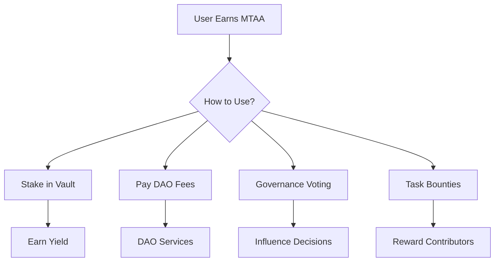
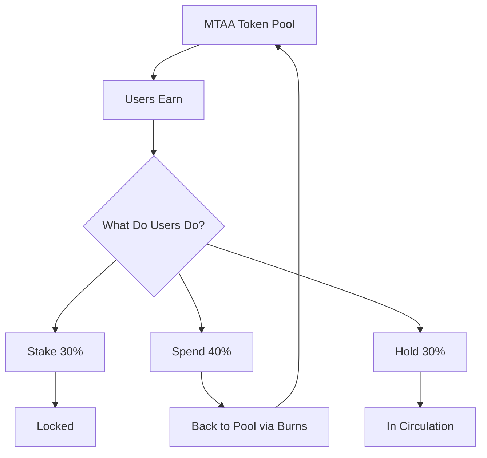

---
title: MTAA Token Flow & Economics
description: How MTAA tokens move through the MtaaDAO ecosystem
---

# MTAA Token Flow & Economics

## Overview

MTAA is the native utility token powering the entire MtaaDAO ecosystem. This page explains how tokens flow between users, DAOs, and platform services.



---

## Token Supply

```typescript
const tokenomics = {
  totalSupply: "1,000,000,000 MTAA",
  
  distribution: {
    communityRewards: {
      amount: "400,000,000 MTAA",
      percentage: "40%",
      vesting: "4 years linear"
    },
    daoTreasury: {
      amount: "200,000,000 MTAA",
      percentage: "20%",
      purpose: "Platform development"
    },
    teamAdvisors: {
      amount: "150,000,000 MTAA",
      percentage: "15%",
      vesting: "3 years, 1-year cliff"
    },
    ecosystemDev: {
      amount: "100,000,000 MTAA",
      percentage: "10%",
      purpose: "Grants, partnerships"
    },
    liquidity: {
      amount: "75,000,000 MTAA",
      percentage: "7.5%",
      purpose: "DEX liquidity"
    },
    publicSale: {
      amount: "50,000,000 MTAA",
      percentage: "5%",
      price: "TBD"
    },
    strategicPartners: {
      amount: "25,000,000 MTAA",
      percentage: "2.5%",
      vesting: "2 years"
    }
  }
};
```

---

## Earning MTAA Tokens

### 1. Daily Challenges

Complete daily tasks to earn MTAA:

```typescript
const dailyChallenges = {
  voteOnProposal: {
    reward: 50,
    description: "Vote on any active proposal",
    frequency: "daily"
  },
  completeTask: {
    reward: 100,
    description: "Complete a task bounty",
    frequency: "daily"
  },
  inviteMember: {
    reward: 200,
    description: "Invite someone to your DAO",
    frequency: "daily"
  },
  commentProposal: {
    reward: 25,
    description: "Comment on a proposal",
    frequency: "daily"
  },
  attendMeeting: {
    reward: 75,
    description: "Attend a DAO meeting",
    frequency: "daily"
  }
};
```

**Streak Multipliers**:
```typescript
const streakBonus = {
  "7 days": "1.5x rewards",
  "30 days": "2x rewards",
  "90 days": "3x rewards",
  "365 days": "5x rewards"
};
```

### 2. Task Bounties

Earn MTAA by completing tasks:

```typescript
const taskRewards = {
  easy: "100-500 MTAA",
  medium: "500-2000 MTAA",
  hard: "2000-10000 MTAA",
  expert: "10000+ MTAA"
};
```

### 3. Governance Participation

Earn for active governance:

```typescript
const governanceRewards = {
  createProposal: 100,
  voteOnProposal: 50,
  commentOnProposal: 25,
  delegateVotes: 10,
  
  bonuses: {
    proposalPassed: 200,
    highEngagement: 150
  }
};
```

### 4. Staking Rewards

Stake MTAA to earn more:

```typescript
const stakingAPY = {
  lock30Days: "8%",
  lock90Days: "10%",
  lock180Days: "12%",
  lock365Days: "15%"
};
```

### 5. Referral Program

Earn when referred users are active:

```typescript
const referralRewards = {
  newUserSignup: 100,
  firstDAOCreation: 500,
  firstTaskCompleted: 200,
  
  weeklyBonus: {
    top10Referrers: [
      { rank: 1, reward: "10,000 MTAA" },
      { rank: 2, reward: "7,500 MTAA" },
      { rank: 3, reward: "5,000 MTAA" },
      { ranks: "4-10", reward: "2,500 MTAA each" }
    ]
  }
};
```

---

## Spending MTAA Tokens

### 1. DAO Operations

```typescript
const daoFees = {
  createDAO: "1,000 MTAA",
  deployVault: "500 MTAA",
  premiumProposal: "100 MTAA",
  analyticsMonthly: "50 MTAA/month",
  customBranding: "200 MTAA"
};
```

### 2. Platform Services

```typescript
const platformServices = {
  proposalHighlighting: "25 MTAA",
  extendedVoting: "50 MTAA",
  multiSigSetup: "100 MTAA",
  advancedNotifications: "10 MTAA/month",
  prioritySupport: "100 MTAA/month"
};
```

### 3. Marketplace Purchases

```typescript
const marketplace = {
  daoTemplates: "50-500 MTAA",
  customIntegrations: "200-1000 MTAA",
  professionalAudit: "5,000 MTAA",
  consultingSession: "500 MTAA/hour"
};
```

---

## Token Burning

Deflationary mechanisms:

```typescript
const burning = {
  quarterly: {
    year1: "10,000,000 MTAA (1%)",
    year2: "15,000,000 MTAA (1.5%)",
    year3: "20,000,000 MTAA (2% annually thereafter)"
  },
  
  sources: {
    platformFees: "50% of fees burned",
    failedProposals: "100% burned (spam prevention)",
    inactiveStakes: "1% after 2 years"
  }
};
```

---

## Circulation Model



---

## Economic Cycles

### Daily Cycle

```typescript
const dailyCycle = {
  morning: {
    activity: "Users complete daily challenges",
    mtaaFlow: "+5,000 MTAA distributed"
  },
  afternoon: {
    activity: "Task bounties completed",
    mtaaFlow: "+3,000 MTAA earned"
  },
  evening: {
    activity: "Governance voting",
    mtaaFlow: "+2,000 MTAA rewards"
  },
  totalDaily: "+10,000 MTAA into circulation"
};
```

### Weekly Cycle

```typescript
const weeklyCycle = {
  sunday: {
    event: "Referral rewards distribution",
    amount: "Top 10 get 42,500 MTAA total"
  },
  weeklyBurn: {
    platformFees: "~5,000 MTAA burned",
    netIncrease: "+65,000 MTAA weekly"
  }
};
```

---

## Vesting Schedules

### Team & Advisors

```solidity
contract TeamVesting {
  uint256 totalAmount = 150_000_000e18;
  uint256 duration = 3 years;
  uint256 cliff = 1 year;
  
  function calculateVested(uint256 elapsed) returns (uint256) {
    if (elapsed < cliff) return 0;
    
    uint256 vestingTime = elapsed - cliff;
    uint256 vestingDuration = duration - cliff;
    
    return (totalAmount * vestingTime) / vestingDuration;
  }
}
```

### Community Rewards

```typescript
const communityVesting = {
  year1: "100,000,000 MTAA",
  year2: "100,000,000 MTAA",
  year3: "100,000,000 MTAA",
  year4: "100,000,000 MTAA",
  
  breakdown: {
    dailyChallenges: "2,000,000/year",
    taskBounties: "50,000,000/year",
    governanceParticipation: "20,000,000/year",
    stakingRewards: "20,000,000/year",
    achievementUnlocks: "10,000,000/year",
    referralProgram: "5,000,000/year",
    contentCreation: "8,000,000/year"
  }
};
```

---

## Price Stability Mechanisms

### Buy Pressure

```typescript
const buyPressure = {
  requiredForDAO: "1,000 MTAA to create",
  stakingDemand: "30% of supply staked",
  burningReduction: "2% annual supply decrease",
  utilityDemand: "Services require MTAA"
};
```

### Sell Pressure Management

```typescript
const sellPressure = {
  vestingSchedule: "Linear unlock prevents dumps",
  stakingLocks: "Tokens locked for 30-365 days",
  burnMechanism: "Reduces supply over time",
  utilityValue: "Real use cases drive holding"
};
```

---

## Token Utility Matrix

| Use Case | MTAA Required | Frequency | Impact |
|----------|---------------|-----------|---------|
| **Create DAO** | 1,000 | One-time | Burn 50% |
| **Deploy Vault** | 500 | One-time | Burn 50% |
| **Stake for Yield** | 1,000+ | Lock period | Locked |
| **Vote on Proposals** | 1+ | Per vote | Locked during vote |
| **Task Bounties** | Variable | Per task | Paid to workers |
| **Premium Features** | 10-200/month | Monthly | Burn 25% |

---

## Economic Security

### Inflation Control

```typescript
const inflationControl = {
  maxDailyIssuance: "0.1% of total supply",
  emissionReduction: {
    year1to3: "100% base rate",
    year4plus: "Reduce 10% per year",
    minimumRate: "10% of original"
  }
};
```

### Treasury Management

```typescript
const treasuryAllocation = {
  total: "200,000,000 MTAA",
  
  reserves: {
    emergency: "50,000,000 MTAA",
    development: "75,000,000 MTAA",
    partnerships: "50,000,000 MTAA",
    communityGrants: "25,000,000 MTAA"
  },
  
  spending: {
    maxPerProposal: "1,000,000 MTAA",
    quarterlyBudget: "5,000,000 MTAA",
    requiresGovernance: ">100,000 MTAA"
  }
};
```

---

## Future Enhancements

### Phase 2 (Q2 2026)
- ✅ **Cross-Chain Bridge**: MTAA on Ethereum, Polygon
- ✅ **Liquidity Mining**: Earn MTAA for providing liquidity
- ✅ **Governance Mining**: Extra rewards for active voters

### Phase 3 (Q3 2026)
- ✅ **Revenue Sharing**: Token holders get platform fees
- ✅ **Buyback Program**: Platform buys MTAA from market
- ✅ **Yield Farming**: Stake MTAA in DeFi protocols

---

## Analytics & Transparency

All token flows are tracked:

```typescript
GET /api/tokenomics/stats

Response: {
  circulatingSupply: "125,000,000 MTAA",
  stakedSupply: "37,500,000 MTAA",
  burnedTotal: "2,500,000 MTAA",
  
  dailyStats: {
    earned: "10,000 MTAA",
    spent: "3,000 MTAA",
    burned: "1,500 MTAA",
    netChange: "+5,500 MTAA"
  }
}
```

---

## Support

Questions about MTAA tokenomics?

- **Whitepaper**: [Read full tokenomics](https://docs.mtaadao.com/whitepaper)
- **Discord**: #tokenomics channel
- **Email**: tokenomics@mtaadao.com
