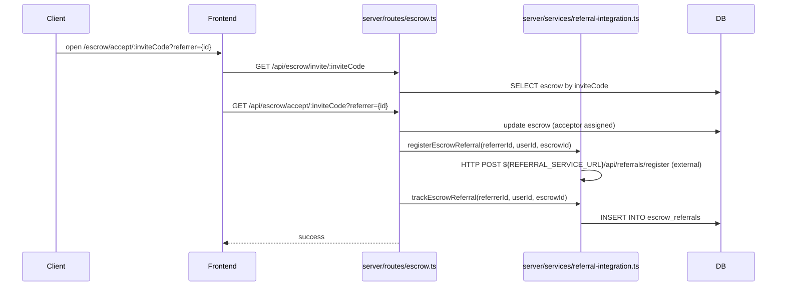
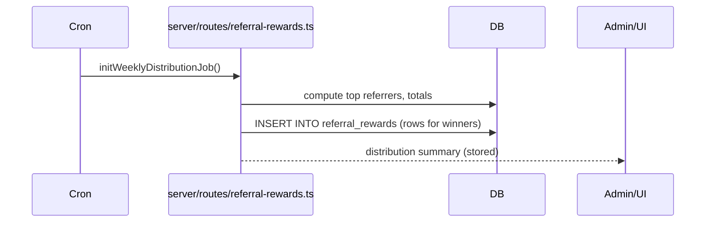
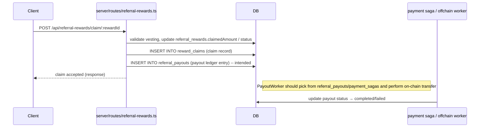

Referral & Invite Flow — Backend ADR

Status: Proposed
Date: 2026-06-18
Authors: GitHub Copilot (audit)

## Purpose
Document the referral and invite flows, exact backend call sites, DB artifacts, gaps, and recommended fixes for referral rewards, escrow invites, weekly distribution, and claim lifecycle.

## Scope
- Escrow invite → accept → referral registration/tracking
- Weekly referral reward computation & distribution
- Reward claim lifecycle (vesting, DB updates, payout orchestration)
- Activity point awards for invites

## Endpoints (implemented / observed)
- POST /api/escrow/accept/:inviteCode — handler: server/routes/escrow.ts (accept handler)
- GET /api/escrow/invite/:inviteCode — handler: server/routes/escrow.ts
- GET /api/referrals/stats — handler: server/routes/referrals.ts
- GET /api/referrals/leaderboard — handler: server/routes/referrals.ts
- POST /api/referrals/distribute-reward — handler: server/routes/referrals.ts
- GET /api/referral-rewards/current-week — handler: server/routes/referral-rewards.ts
- GET /api/referral-rewards/history — handler: server/routes/referral-rewards.ts
- POST /api/referral-rewards/claim/:rewardId — handler: server/routes/referral-rewards.ts
- POST /api/referral-rewards/distribute — handler: server/routes/referral-rewards.ts

Frontend entry points that start flows:
- client/src/pages/escrow-accept.tsx — user clicks Accept, calls `GET /api/escrow/accept/:inviteCode?referrer={payerId}`
- components/referral/* — dashboard UI and simulation panels (call referral endpoints or show simulated rewards)

## Key DB artifacts (schema references)
- shared/schema.ts — `referral_rewards`, `referral_tiers`, `users.referredBy`, `users.referralCode`, `escrow` and related fields
- shared/financialEnhancedSchema.ts — `referral_payouts` ledger and financial tables
- (observed references) `reward_claims`, `escrow_referrals`, `payment_sagas` — used by code but migrations / orchestration may be missing

## Sequence Diagrams (Mermaid)

Escrow invite accept → referral registration/tracking

Weekly distribution (cron)

Claim flow (user claim -> DB record -> payout ledger)

## Exact Call-Site Mapping (file → function → short note)
- client/src/pages/escrow-accept.tsx → `handleAccept()` — calls `GET /api/escrow/accept/:inviteCode?referrer={id}` when user accepts.
- server/routes/escrow.ts → `POST/GET /accept/:inviteCode` (accept handler) — updates escrow, calls referral integration functions.
- server/services/referral-integration.ts → `registerEscrowReferral(referrerId, userId, escrowId)` — performs HTTP POST to external referral service (REFERRAL_SERVICE_URL).
- server/services/referral-integration.ts → `trackEscrowReferral(referrerId, userId, escrowId)` — writes to `escrow_referrals` table.
- server/routes/referral-rewards.ts → `initWeeklyDistributionJob()` — cron job computing weekly winners and inserting `referral_rewards` rows.
- server/routes/referral-rewards.ts → `POST /claim/:rewardId` — claim handler: checks vesting, updates `referral_rewards` and inserts `reward_claims`.
- server/routes/referrals.ts → GET `/stats`, GET `/leaderboard`, POST `/distribute-reward` — admin/utility functions; use `walletTransactions` for bookkeeping in places.
- server/services/activity-service.ts & activity-award-helper.ts → award activity points for invite signup (e.g., +10), update `user_activities` / `user_stats`.
- server/storage.ts → `createUser()` — user create path used by OAuth and registration flows; signup handlers may set `users.referredBy` if referral query param present.

Where to find schema and related table defs:
- shared/schema.ts — referral-related tables and user fields
- shared/financialEnhancedSchema.ts — referral_payouts ledger

## Gaps & Risks (observed)
- Claim endpoint writes DB records but does NOT perform on-chain transfer; comments indicate missing token transfer steps.
- `reward_claims` and `escrow_referrals` references exist in code; migration files may be missing or incomplete — verify and add migrations if absent.
- `referral_payouts` ledger exists but no reliable payout worker or saga orchestration currently wired to process ledger → risk of claims never settled on-chain.
- External dependency: `REFERRAL_SERVICE_URL` used by `registerEscrowReferral` — if unavailable, registration may fail; code should be resilient / retried.
- Anti‑abuse: current flow awards signup/vesting without mandatory first contribution check; risk of Sybil / fake accounts farming rewards.

## Recommendations (short actionable items)
1. Implement a payout worker that consumes `referral_payouts` / `payment_sagas` and performs idempotent on-chain transfers; include retries and failure handling.
2. Add SQL migrations for `reward_claims` and `escrow_referrals` and ensure schema matches code expectations.
3. In `POST /claim/:rewardId` implement a safe enqueue-to-payout step (insert into `referral_payouts` and mark `reward_claims.pending`), do NOT perform on-chain transfer synchronously in the API request.
4. Require a minimal anti‑abuse condition before granting on-chain tokens (e.g., first contribution, email/phone verification, KYC rules depending on token value).
5. Make `registerEscrowReferral` resilient: retry on transient failures, and backfill failed registrations via admin job.
6. Add observability: logs/metrics around cron distribution, claim insertions, payout processing, and failed transfers.

## Next steps
- I can: (A) validate migrations exist and add missing SQL migration files; (B) implement enqueue-only changes in claim handler and scaffold payout worker; (C) run repository tests/local integration simulation. Which should I do next?
